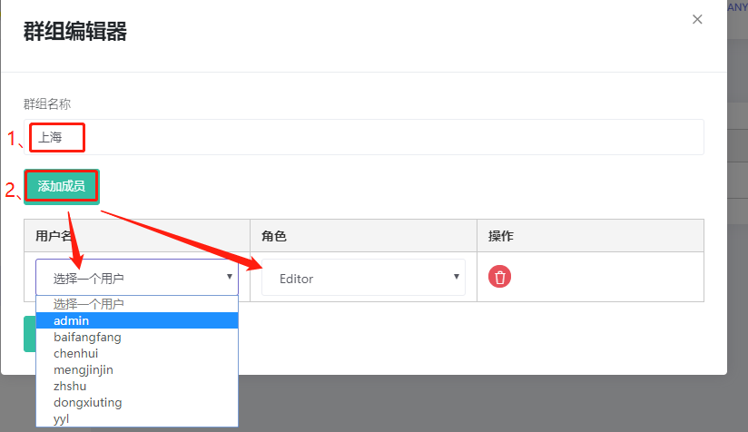
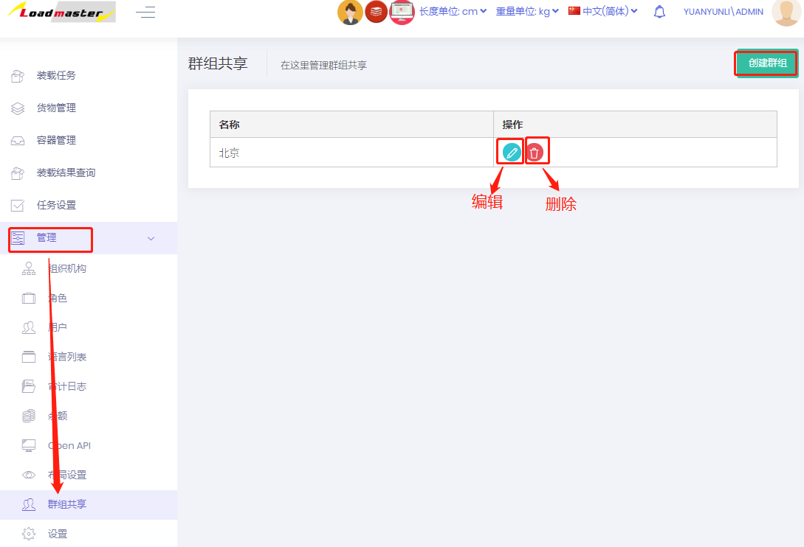
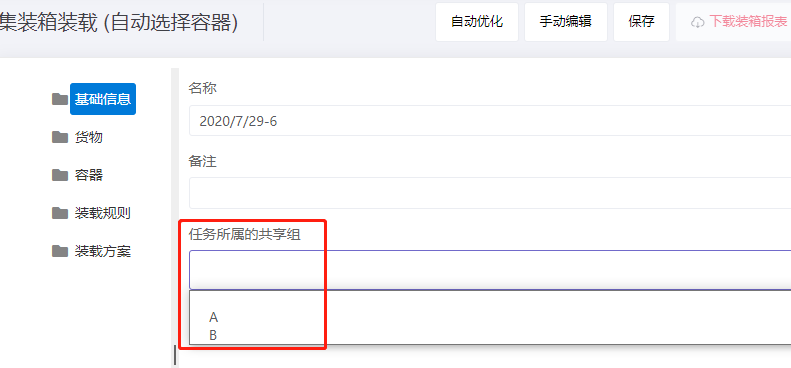

# b、分配和管理共享组

在一个租户名下创建了多个用户后，可以将用户分组, 并限制用户对任务可进行的操作。 例如A集团下有多个分公司，为了方便管理， 集团共用一个租户，但是分公司与分公司之间数据不共享， 这就需要分配共享组。

## 群组功能的开启

用户的群组功能默认是关闭的， 需要租户的管理员手动开启。 在【管理】&gt;【设置】&gt;【用户管理\]】中， 勾选“启用用户群组”，最后点击“保存全部”， 并重新登陆账号。群组功能关闭时，租户下的用户可以看到所有的任务。

此设置只能管理员设置, 其他用户看不到这个设置。


## 群组的管理

在【管理】&gt;【群组共享】中，点击右上角的"创建群组"。

在弹框中，设置群组名称，添加此组的成员并定义成员角色后， 点击确定。



创建好的群组可以修改或删除， 成员退出并再次登陆后修改生效。



## 成员的角色

* 每个群组成员有4种角色: Admin, Manger, Editor, Guest。 权限大小: Admin&gt;Manger&gt;Editor&gt;Guest。
* 批准是一种状态, 表示方案已经经过审核通过不需要修改. 点击批准按钮就可以把任务转换为批准状态。


    

* 每个人能批准的任务包括未批准且属于"自己拥有至少Manger权限的群组"的任务。
* 每个人可以看到自己创建的任务和所有属于"他所在的群组"的任务。
* 每个人能编辑的任务包括:

  ```text
            未批准的任务: 自己创建的任务或者属于"自己拥有至少Editor权限的群组"的任务.

            已批准的任务: 属于"自己拥有至少Manger权限的群组"的任务.
  ```

* 每个人能删除的任务包括:

```text
          未批准的任务: 自己创建的任务或者属于"自己至少有Manger权限的群组"的任务.
          已批准的任务: 属于"自己拥有至少Admin权限的群组"的任务.  
```

* 用户修改一个装载任务的群组时, 只能把任务的群组修改为"自己至少有Editor权限的群组"。

## 在创建任务后, 在基础信息界面, 可以选择任务所属的群组。



## 案例

某集团下有A、B、C、D四个分公司，分公司之间的数据不共享，集团总部管理员要查看及管理A、B、C、D所有的任务，如何设置？

1、总部管理员用“admin”账户为下面分公司建立好所需要的用户，步骤详见《[多用户数据共享](https://doc.zhuangxiang.com/tutorial/together%20land.html)》。按照上文中的步骤，开启群组功能并创建A、B、C、D四个群组。

2、将总部管理员分别添加到A、B、C、D四个群组中，即想看到哪个群组的数据就要成为哪个群组的成员

3、成为成员后，所有人创建任务计算方案时，一定要选择“任务所属的分享群组”，若不选择，则此任务只有创建者自己可以看到，群组其他成员无法看到。


二、角色分配：有4种角色：Admin、Manger、Editor、Guest可以分配给群组成员，权限大小：Admin&gt;Manger&gt;Editor&gt;Guest.

1、Guest只能查看所在群组中其他成员创建的任务；自己也可以编辑、删除、分享自己创建的任务，但无法选择任务所属的分享群组，所以群组其他人成员无法看到。

2、群组内除Guest的其他成员创建任务，并将任务选择所属群组后

* 在任务未批准前

  Admin、Manger可以批准、编辑、删除、分享所有任务。

  Editor可以编辑、分享，但只可以删除自己创建的任务。

  Guest只可以查看。

* 在任务批准后

  Admin可以编辑、分享、删除。

  Manger可以编辑、分享。

  Editor、Guest只可以查看。

