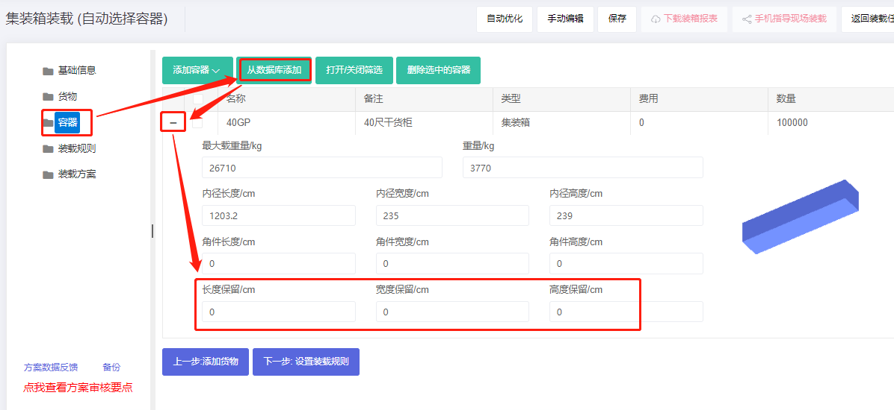
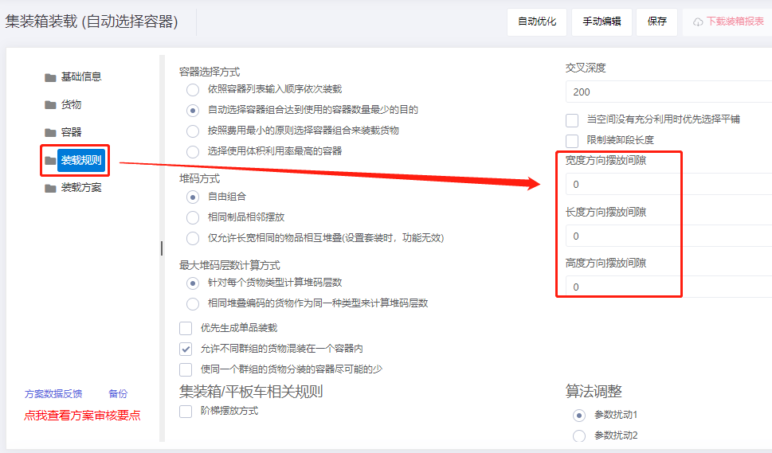

# a、如何模拟货物胀箱和摆放间隙

现实装载操作中，货物摆放缝隙或胀箱是不可避免的，为了保证设计的装箱方案切实可行，需要预先留出一定的尺寸以保证现场可以完全装载完所有的货物。 有下面几种情形和方法：

1）若货物尺寸是实际测量尺寸或货物生产后直接装柜，而且集装箱尺寸是标准内寸（即20GP:589\*235\*239CM、40GP：1200\*235\*239CM、40HQ：1200\*235\*269CM）,这时应设置集装箱保留尺寸或货物摆放缝隙**两种方法之一**来模拟人工摆放间隙情形。它们是一个经验值，可使用软件方案指导现场装载后，总结应该扣除多少为宜。

①在容器界面设置保留尺寸，首次使用建议如下：

包装箱全部是纸箱包装的话，或大部分是纸箱包装，个别是木箱铁箱等包装，人工直接装柜。

20GP长保留5-8CM，宽保留3-5CM,高保留3-5CM。

40GP长保留10-15CM，宽保留3-5CM,高保留3-5CM。

40HQ长保留10-15CM，宽保留3-5CM,高保留3-5CM。

产品包装箱全部是木箱或托盘或铁箱，不涉及到纸箱装载，或只有极少数的纸箱，使用叉车装柜。

20GP内径长扣除5-10CM，宽扣除3-5CM，高扣除10CM

40GP\40HQ长扣除13-15CM，宽扣除3-5CM，高扣除10CM

集装箱高扣除10CM，请将集装箱角件设置为0。因为集装箱角件10CM也已经被扣除掉了。

②在装载规则界面，合理设置每件货物之间的摆放缝隙，首次使用建议设置1CM左右。

2）若货物是纸箱包装，尺寸是理论尺寸，货物生产后会在仓库保管一两周以上再发货，这时应考虑纸箱因仓库叠放积压导致的涨箱情形。根据日本专家试验，货物在仓库叠放因积压导致纸箱变形的幅度是原尺寸的1%-1.8%。

3）若货物尺寸已放大了1-2CM，可以不用设置集装箱保留尺寸或货物摆放缝隙。

4）若集装箱尺寸已做合理扣除，不需要再设置集装箱保留尺寸或货物摆放缝隙。

