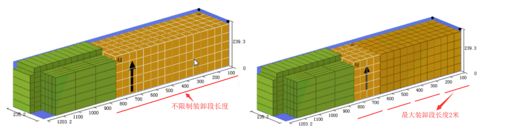

# 2、是否正确定义了配载规则

1、若想让相同的货物尽量摆放一起，请设置“相同制品相邻摆放“，同时设置”交叉深度”。

2、交叉深度的适用于“相同制品相邻摆放”或先后装载\(即设置“空间顺序“\)的两种业务场景。一般情况下，交叉深度数值越大，装载率越高。若按软件默认的交叉深度200CM计算，存在有的空间没有充分利用，请记得将交叉深度数值修改偏大些哦。

3、若存在某种产品的装载步骤较长，请设置最大装卸段长度。

