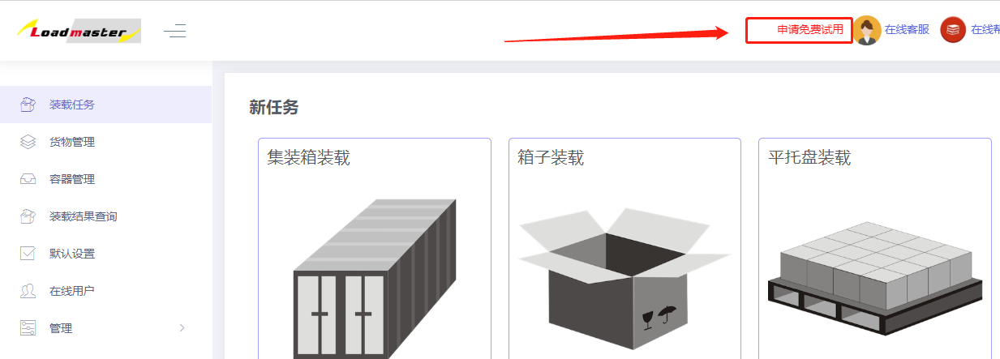

# 1、账户注册及申请免费试用

**a、账户注册**

第一步：进入装箱大师Web主页：[https://app.zhuangxiang.com](https://app.zhuangxiang.com)，点击“新用户注册”如下图：

第二步：进入注册页面，填写注册信息，包括租户名，公司名，管理员邮箱以及密码。

租户名即租户ID，登陆时必须填写必须填写，由2个以上字母、数字、-、\_组成,以字母开头；

勾选“同意用户协议”，最后点击“提交”。

第三步：激活账户，注册成功后系统会向填写的邮箱中发送邮件，在邮件中会包含**租户名称，用户名，密码和激活链接**。

点击激活链接，就可以激活账户，账户激活后会自动跳转到登录界面。

第四步：在登陆页面，输入**租户名、用户名**（初始的用户名为“**admin**”）和**密码**登录即可，登录成功后就可以使用。

**b、申请免费试用**

注册成功并登录后，软件默认的是按次付费模式，但我们为每个公司提供一次免费试用机会（免费一个月），申请步骤如下：

第一步：点击软件上方的”申请免费试用“，进入申请页面。

第二步：填写信息，包括邮箱（**必须为公司邮箱，服务器会自动识别，若没有公司邮箱，则无法提交，请联系客服**）、公司名称、手机号、联系人、验证码，点击提交即可免费试用，提交成功后，试用开始计时，一个月后会自动变为按次付费模式。

