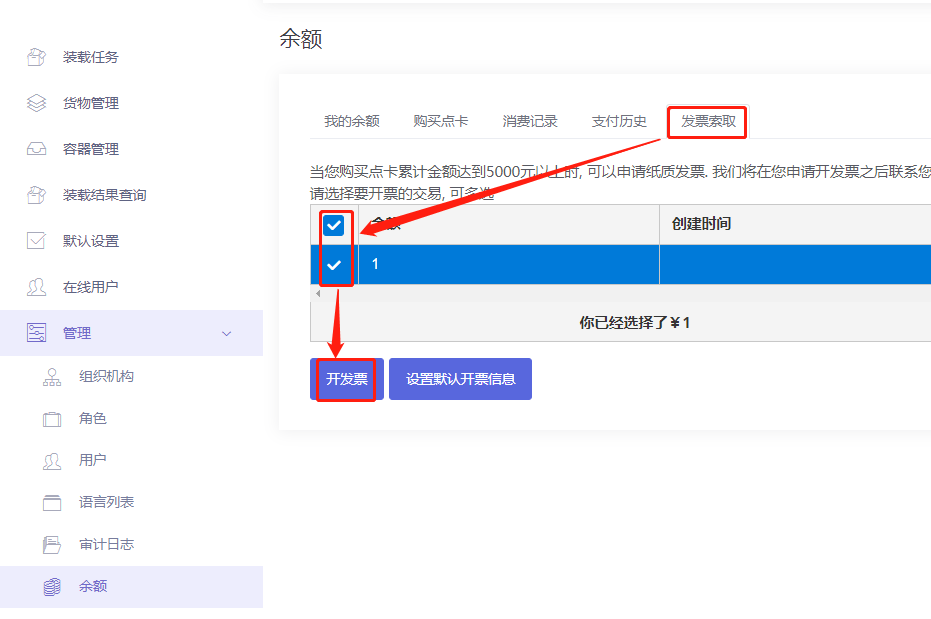
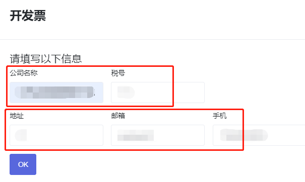

# 6、关于发票

充值点卡后，如何在线申请电子发票？

1）在首页点击【管理】下“余额”，然后点击“发票索取”。

2）此页面是展示出历史付款记录，根据需求勾选需要开票的金额，然后点击“开发票“。

3）再弹框中，填写开票信息（包括公司名称及税号）和接受发票的邮箱、手机号、地址，点击”OK“。

4）发票申请成功后，2-3个工作日开好的电子发票会发送到您填写的邮箱和手机号上，请您注意查收。

