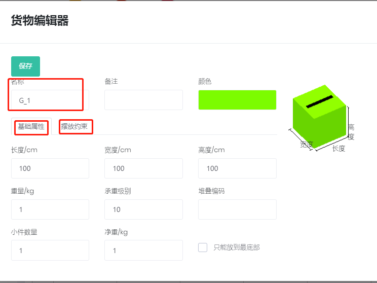
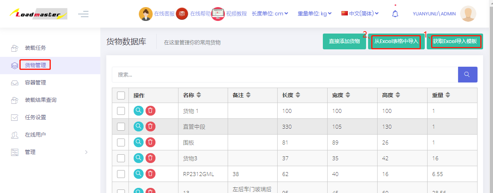
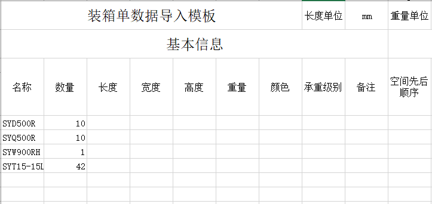

# 按订单模式导入

当货物的尺寸不会因订单改变而改变时，为了避免每次重复输入货物数据，可以将常用的货物数据维护到货物数据库中，设计方案时，只需按照订单输入货物的名称、数量及涉及到的参数即可，货物的尺寸、摆放方式、承重级别等已经维护到数据库中的信息会自动抓取。

**具体步骤如下：**

1）将货物数据维护到数据库中，在软件首页左侧，点击“货物管理”，进入货物数据库。可通过“直接添加”和“从excel表格中导入”两种方式。

①直接添加：当货物种类较少时，逐个添加。

点击“直接添加货物”，在弹框中编辑货物基本属性（名称、尺寸、承重级别等）和摆放约束（摆放方式、堆码层数等）。

**其中货物的名称必须唯一，最后点击保存。**

②批量导入：当货物种类较多时，可以用excel批量导入。

首先点击“获取excel导入模板”下载模板，保存到电脑某个位置；

然后填写导入模板，填写完成后，回到软件点击“从excel表格中导入”，找到填写到的模板，点击打开，货物信息就添加到数据库中。**模板填写说明：**

* 货物名称必须唯一，不得重名。若有重名，软件会自动识别并会提示重复的行数。
* 注意单位的换算。
* 重量不得为空。若是轻货且或不清楚具体重量，可填写为1。
* 模板中默认六种摆放方式都允许，即随意摆放。不允许的摆放方式，设置为0。允许的摆放方式，设置为1或不设，都代表允许。
* 承重级别：可按货物【单箱毛重】或【密度】设置承重级别，实现重不压轻。承重级别是个相对值，数值越大，代表承载能力越强，越装在底下。承重级别取值范围是0-254。

2）将货物信息添加到数据库中后，设计方案时，在货物界面，点击【添加货物】下的“获取导入模板”下载模板。

3）在打开的模板中，将所需货物的名称、数量复制进来，然后根据装载要求设置所需的参数（已经在数据库定义好的参数不用再设置）。

4）模板填写完，保存后关闭，回到货物界面，点击【添加货物】下的“按订单模式导入”，在弹框中找到填写好的模板，点击打开，软件就会根据货物名称抓取数据库中的信息。

