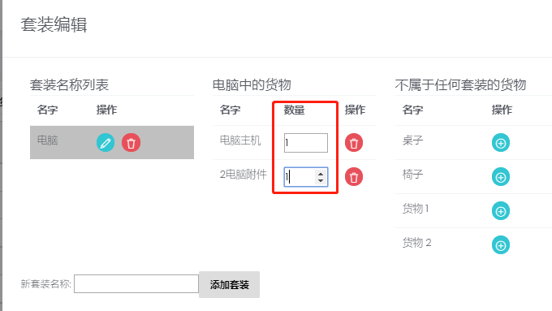

# 成套装载

一款产品分拆为多个箱规，或一套产品由多个不同产品组成，装柜时必须保证这些箱规按比例装载。举例：一台电脑由

1箱主机和1箱附件组成，一套家具由1箱茶几和4箱椅子组成。

方法一:在导入模拟板中设置，套装产品设置相同的套装名称，并设置一套内的包含的数量。

方法二：在软件中设置，套装产品设置相同的套装名称，并设置一套内的包含的数量。

第一步：在货物界面，点击套装设置

第二步：填写套装名称后，点击添加套装

第三步:点击套装名称后绿色按钮

第四步：点击货物名称后绿色添加按钮，添加套装内的货物，并设置装载比例。

同理，在添加其他套装。

