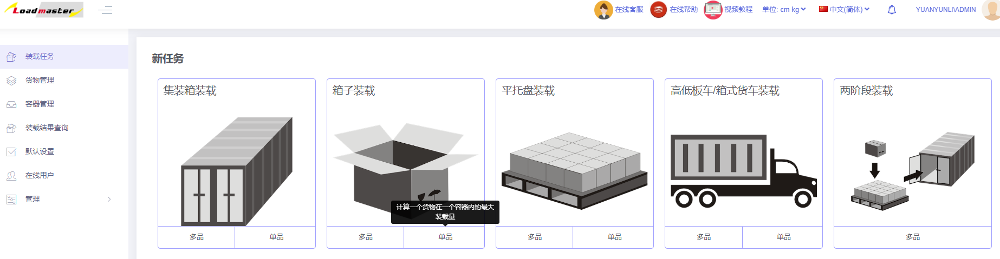

# 1、装载任务

在使用账号登录后会进入装载任务管理界面，此界面分为新任务和历史任务列表上下两大部分：

1）上方区域的作用是新建任务，用户根据自己的需求选择合适的任务类型，点击进入，就可以进行方案的设计。

共有五个种任务类型可以选择：集装箱装载、箱子装载、托盘装载、两阶段装载。

* 每种里面又分多品和单品装载：多品是计算多种规格的货物装载；单品是计算一种规格的货物最多装多少。
* 选择哪种装载设计装载方案时只能添加对应的容器，例如选择集装箱装载，容器只能添加集装箱；选择托盘装载，容器只能选托盘。
* 两阶段装载是指一步计算货物如何先装到托盘或箱子等中间包装中，再如何装到集装箱中。

2）下方区域的作用是查看或编辑以前创建的任务，可以看到每个任务的名称，备注，创建者和修改时间。

任务列表左侧操作区域有三个工具按钮：

①左侧的按钮是用于编辑查看任务，点击后会自动跳转到方案设计页面，可以进行查阅或修改。

②中间的按钮是用于分享方案，可以扫描二维码或分享方案链接在移动端查看方案和装载步骤指导现场装载，也可以通过邮箱发送给同事和客户，具体详情可查看相关介绍。

③右侧的按钮是用于删除此装载任务。

注：①如果需要批量删除任务，可以点击最左边的复选框，然后点击上方出现的“删除选中的任务”，也可以删除空任务。

②点击任务列表上方的搜索框，输入装载任务名称的关键字，即可快速查到相关的装载任务。也可以根据需求选择时间段。

