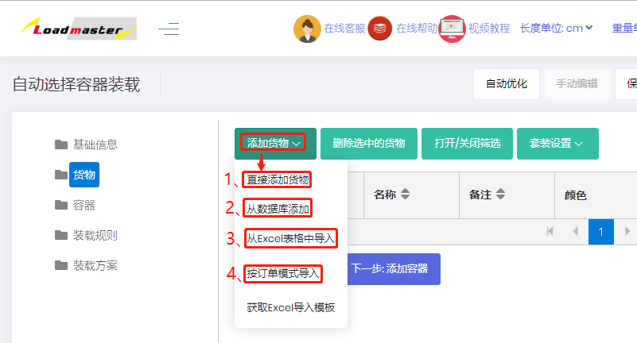

# 2）货物

货物界面主要是用来添加需要装载的货物，编辑货物的基本信息（名称、数量、长宽高等）并根据装载要求定义货物的摆放方式和装载属性，例如轻重搭配、先后装载等。

页面分为两部分：上方是功能按钮，下方是货物列表。

1）上方功能按钮包括【添加货物】、【删除选中的货物】、【打开/关闭筛选】、【套装设置】。

①“添加货物”按钮的功能是添加所需要装载的货物：有“直接添加货物”、“从数据库添加”、“从Excel表格中导入”、“按订单模式导入”四种方式，具体详情请查看[添加货物的方法](https://doc.zhuangxiang.com/page/goods/add%20way.html)。

②“删除选中的货物”按钮的功能是删除选中的货物。

* 分别勾选货物名称前的方框，然后点击货物列表上方的“删除选中的货物”可以同时删除多个货物。
* 点击货物列表左上角的方框，可以全部选中本页所有货物，并且可以调整每页显示货物的行数。
* 可以选中任意货物，然后点击列表上方出现的“全部删除”，可以一次性删除所有货物。注：未选中货物时，“全部删除”不会显示。

③“打开/关闭筛选”按钮的功能是打开或关闭关键词筛选功能。

④“套装设置”按钮的功能是添加或删除套装。

当一款产品分拆为多个箱子，或一套产品由多个不同产品组成，装柜时必须保证这些箱子按比例装载。可以通过套装功能处理这种情况。对于输入的货物，可以定义他们的成套关系，具体步骤详情请查看[定义套装货物](https://doc.zhuangxiang.com/work/cheng-tao-zhuang-zai.html)。

2）下方货物列表是已经添加的货物的列表。可以查看或修改货物的信息（名称、数量、长宽高等）、摆放方式、装载参数。  
①货物列表左侧有加号按钮：点击后可以查看和编辑此货物的摆放方式、最大堆码层数、最大悬空比等参数，参数具体详情请查看[货物摆放约束](https://doc.zhuangxiang.com/page/goods/put%20way.html)。

②货物列表右侧是货物的名称、数量、长宽高、重量、承重级别、空间顺序等信息，可以进行编辑修改，具体参数详情请查看文档中的介绍。

* 可以左右任意调整功能栏的位置，例如某案例需要设置 “承重级别”，可以将它移动到左侧，方便查看。点击“承重级别”，按住鼠标左键不放拖动到所需位置即可。

*  可以根据任意参数对货物进行排序，例如按照货物的长度进行排序，只需点击表头的“长度”，货物就会按照货物的长度由大到小排序，再点击一次，货物会按照货物的长度由小到大排序。

* 在货物列表的右上角，可以看到有输入货物的总数量和总体积。

