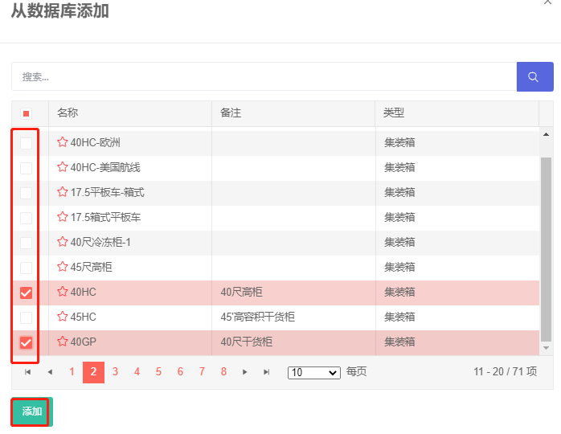

# 3）容器

容器界面主要是用来添加装载货物的容器，可以查看或编辑容器相关的信息。

页面分为两部分：上方是功能按钮，下方是容器列表。

1）上方功能按钮包括：“添加容器”、“从数据库添加“、”打开/关闭筛选“、“删除选中的容器”。

①“添加容器”按钮的功能是直接添加所需容器，可以添加装载任务对应的容器，例如选择集装箱装载，容器只能添加集装箱；选择托盘装载，容器只能选托盘。

②“从数据库添加“按钮的功能是从数据库导入所需的容器，容器数据库中已存储常用容器的信息，或者将经常使用的容器维护到数据库，
这样后续设计方案时避免每次重复输入，可以直接从数据库导入。可提高后续配载计算的工作效率。

③“打开/关闭筛选”按钮的功能是打开或关闭关键词筛选功能。

④“删除选中的容器”按钮的功能是批量删除选中的容器，点击货物列表左侧的方框选中需要删除的容器，然后点击“删除选中的货物”按钮，即可批量删除选中的货物。注：点击货物列表左上角的方框可全部选中列表中的货物。

2）下方是已经添加的容器列表，左侧有加号按钮，点击后可以查看和编辑此容器的相关参数，详情请参看[容器属性](https://doc.zhuangxiang.com/page/container/property.html)；容器列表右侧是容器的名称、备注、类型，费用、数量可以进行编辑修改。

