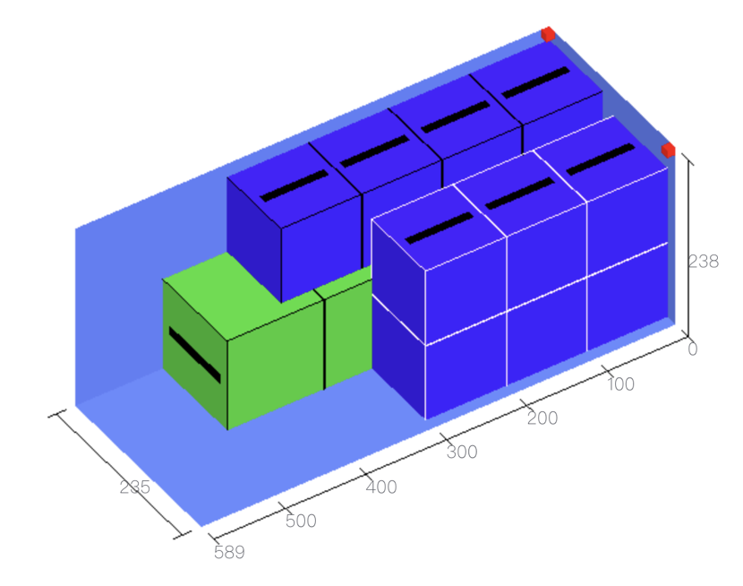

# b、容器属性

容器类型包括：平托盘、箱子、集装箱、高地板车四种，所有容器都有名称、长宽高、数量、类型、费用这些基本属性，但每种容器还有相对应的属性。

1）平托盘对应的属性还包括：最大摆放高度、长度方向允许出边、宽度方向允许出边。

①最大摆放高度：允许货物在托盘中摆放的最大高度，包括托盘自身高度。

②长度方向、宽度方向允许出边：允许托盘上货物在长度方向和宽度方向允许超出托盘的尺寸大小。

2）箱子可以是木箱或铁箱，对应的属性包括：外部长宽高、内径长宽高。内部长宽高是为了定义货物装箱子时容器的尺寸；外部长宽高为了定义装好货物的箱子装集装箱时货物的尺寸。

3）集装箱对应的属性还包括：集装箱最大载重量、内部长宽高、角件的长宽高、长度宽度高度保留尺寸。

①最大载重量：当装载的货物较重时，为了安全运输，方案优化时软件自动限制货物总重量不能超过集装箱最大载重量。

②角件长宽高：下图中的红色部分即为角件。角件是集装箱顶角的两个紧固件，虽占据集装箱空间不大，即使装箱人员凭经验装箱技巧，往往也会因估计不足而出现少装货物或集装箱装不下的情况。装箱大师只需要用户定义角件尺寸，在优化方案时自动躲避角件。

③保留尺寸：现实装载操作中，货物摆放缝隙或胀箱是不可避免的，为了保证设计的装箱方案切实可行，需要预先留出一定的尺寸以保证现场可以完全装载完所有的货物，

集装箱长宽高方向扣除多少为宜，它是一个经验值。可使用软件方案指导现场装载后，总结应该扣除多少为宜。

如果使用叉车装柜，初次使用软件时，建议设置下面的保留尺寸：

1、20GP内径长扣除5-10CM，宽扣除3-5CM，高扣除10CM  
2、40GP\40HQ长扣除13-15CM，宽扣除3-5CM，高扣除10CM

如果是人工装柜，包装箱大多数是纸箱包装。一般建议设置下面的保留尺寸：

1、20GP内径长扣除5-10CM，宽扣除3-5CM，高扣除3-5C  
2、40GP\40HQ长扣除13-15CM，宽扣除3-5CM，高扣除3-5C。

4）高低板车对应的属性还包括：板车的长宽高，高板的长度和高度。

板车的高度指的是货物允许摆放的最大高度。

