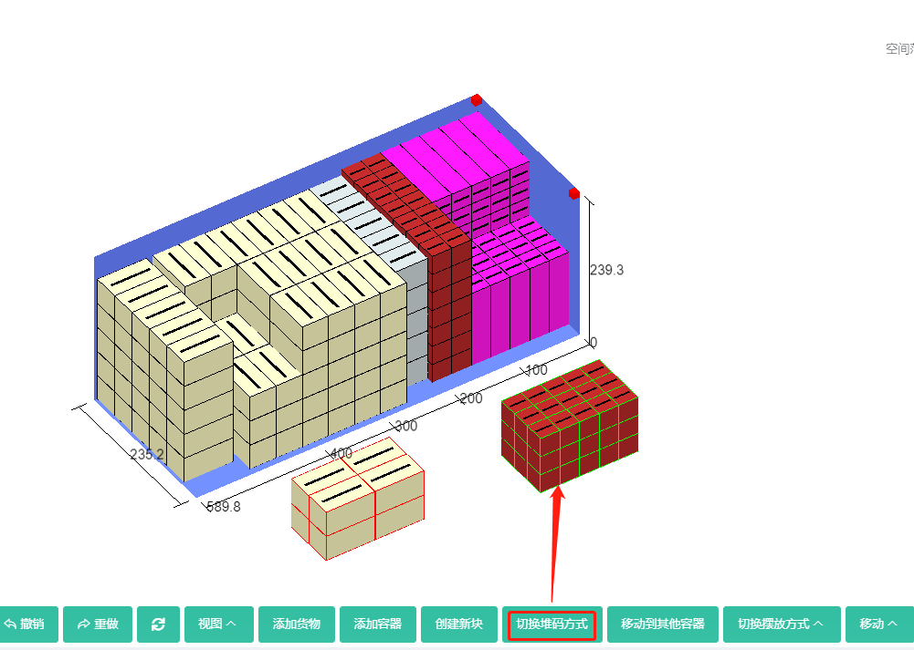
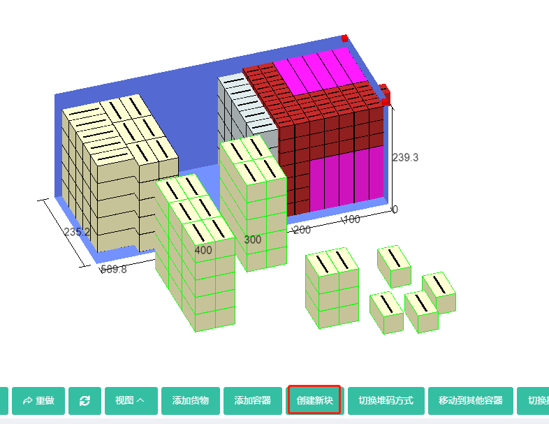
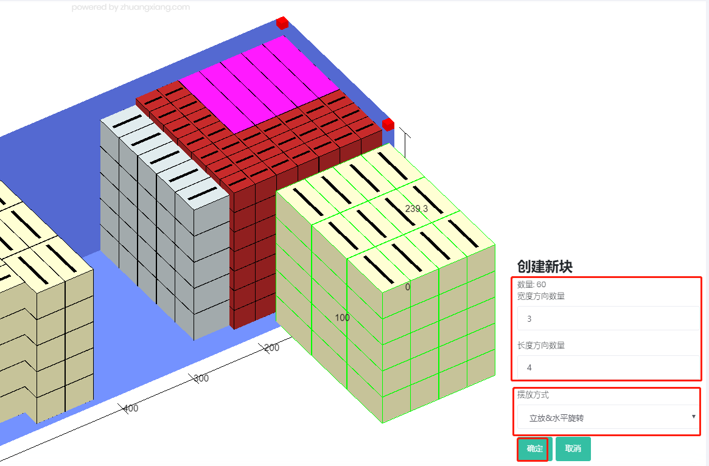
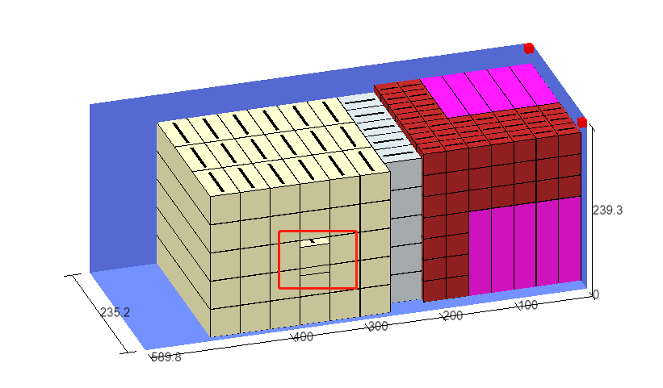
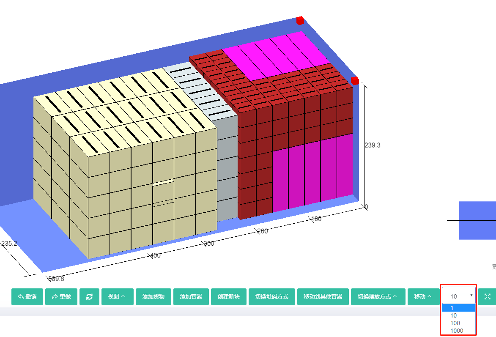

# 8、手动编辑

若遇到个性化需求场景下，可借助手动编辑功能达到相关目的，那么如何使用手动编辑？

点击软件上方的“手动编辑”按钮，进入手动编辑界面。

1）界面左侧是容器列表和备货区，备货区是用来储存因尺寸过大无法装载的货物或存放想要删除的货物；

2）中间是编辑区，主要是在此处进行编辑；

3）右下角是重心偏移的示图和实时数据；

4）界面下方是手动编辑的各项功能。

下面介绍下常用的手动编辑功能：

**1）如何移动货物**

例如将最后一行货物移出集装箱，再放入集装箱。

首先点击选中货物，按住鼠标左键不放拖动，将它拽出；然后将它再放入集装箱，当靠近其他货物时会跳起，

所以需要在它没有跳起时，左手按住键盘的Ctrl键不放，再拖动，货物就不会跳起了。注：货物线条是红色，代表在货柜外；货物线条是绿色，代表在货柜内。

**2）如何将货物互换位置及改变装卸块形状**

例如将C和B互换位置

首先分别点击选中B、C，按住鼠标左键不放将它们拽出集装箱，若是将它们放在空隙位置 ，需要改变装卸块形状。

**那么如何改变装卸段形状呢？**

可以通过软件下方改变堆码方式或改变摆放方式来改变装卸块形状。

改变堆码方式：是指在不改变货物摆放方式前提下，通过行列的变化调整装卸块的形状。

比如C摆放方式是立放、堆码方式是3\*5\*3，点击“改变堆码方式”，它的摆放方式没有改变，还是立放，堆码方式变为5\*3\*3。

改变摆放方式：是指在不改变货物行列的前提下，通过改变货物的摆放方式调整装卸块的形状。

比如B摆放方式是侧放，堆码方式2\*2\*2，点击“改变摆放方式”，将它的摆放方式选为“立放水平旋转”，堆码方式没变，还是2\*2\*2。

这就是如何改变装卸快形状。

将B放入后面的空隙位置，那么如何判断红色的C能否放入到前面空隙位置？

首先确定装卸块的大小，点击选中C，在左上角可以看到它的空间占用范围，长度方向相减得出装卸块的长为150，同理，得出宽为90，高为90。

然后判断空隙的大小，点击空隙后面的货物，在左上角可以看到货物长度方向是从150开始的，集装箱前面为0，所以空隙位置长为150；点击空隙左侧的货物，在左上角可以看到货物宽度方向是从120结束的，而集装箱宽为235，所以空隙的宽为115，大于90；同理得出空隙的高大于90，所以完全放得下。

将C放入前面的空隙位置，B和C互换位置完成。

**3）如何拆分或重组装卸块**

以中间的黄色装卸快为例，选中装卸块，在需要切割的地方右击鼠标。

可以将它在行、列、层方向进行切割，完全分解就是将装卸块完全拆分为单个货物。

**那么如何重新创建新的装卸块呢？**

例如将拆分的黄色装卸块重新组合成4行3列5层的装卸块，摆放方式为立方水平旋转。

左手按住ctrl键不放，右手用鼠标将拆分的黄色货物全部选中，然后点击下方的“创建新块”按钮。

在弹框中将摆放方式定义为立方水平旋转；将长度方向数量设置为4；宽度方向数量设置为3。点击确定，装卸块就组合完成了。将其移动到集装箱内。

**4）如何添加货物和容器**

例如：向集装箱1内再添加63个C，并增加一个40GP。

点击立体图下方“添加货物”

弹框中会显示任务中已有类型和数据库中的货物，找到并选中C，然后在下方数量一栏填写63，点击确定，成功添加了63个C。

将它创建为新的装卸块，放入到集装箱内。

同理，点击下方的“添加容器”，在弹框中的“从数据库添加”中，找到并选中40GP，点击确定即可。

**5）如何在不同的货柜之间移动货物**

例如将最后一行货物移到40GP内。

选中最后一行货物，点击立体图下方的“移动到其他容器” ，在弹框中选择40GP即可。

**6）如何删除货物和空容器**

例如删除40GP内的货物。

选中想要删除的货物，右击鼠标，在弹框中点击“删除”即可。空容器在手动编辑完成，点击保存后，会自动删除。

**7）如何将货物放入中间的空隙中，并与其他货物靠紧但不重合**

当遇到货物不能直接拖到空隙中时，如何操作？

例如将下图中的黄色货物放入空隙位置。

选中货物后，左手按住Ctrl键不放，右手用鼠标点击软件下方的【移动】中的“上移、左移”，将货物大致放入空隙。

然后继续按住Ctrl键不放，用鼠标左键拖动，将货物放入空隙中即可。但是当遇到货物重合，无法用鼠标拖动时，如下图

此时就要左手按住Ctrl键不放，右手用鼠标点击软件下方的【移动】下对应的移动按钮，有时会发现护货物还是会重合，这时要在软件下方调节每次移动的步长再移动。

最后在根据空间占用情况，判断货物是否靠近且没有重合，选中它下方的货物，在右上角看到它的高度方向是在80结束的，而它是从80开始的，同理查看其他方向即可判断。

手动编辑完成，点击右下角的“保存”按钮，就可以看到手动编辑后的装载方案。

手动编辑有下面几个的小技巧：

1）货物线条是红色，代表在货柜外；货物线条是绿色，代表在货柜内。

2）移动货物时：右手按住鼠标左键移动。

3）货物定位时：左手按住ctrl键，右手按住鼠标左键移动，直到定好位置再松手，货物就不会跳起了。

4）组建新装卸块时，左手按住ctrl键，右手点击鼠标，可以选中多个装卸块。

5）点击撤销按钮可以取消当前操作，返回上一步。

最后手动编辑有几个注意事项：

1）手动编辑后的方案，一旦点击自动优化重新计算，则丢失手动编辑后的方案。

2）若无法从货柜内移出货物：这说明键盘的ctrl键失灵了，还在按住不放的状态。请用力敲打下此键再操作。

3）有时因鼠标质量原因，导致不能很好地控制货物的移动，这时可尝试换个鼠标试试。

4）因第一次使用手动编辑功能，比较陌生，初次感觉比较难用，这是正常的。使用上一周就会发现操作非常简便灵活。

