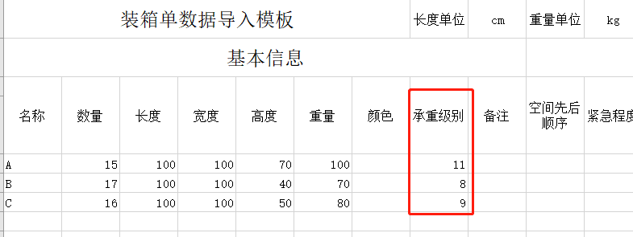
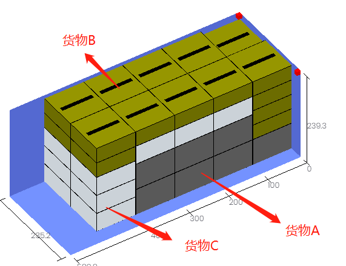

# 承重级别

当装载要求涉及到轻重搭配、重不压轻或大不压小时，可按货物的【单箱毛重】或【密度】或【大小】设置承重级别。

承重级别的大小表示该货物的承重能力大小，承重级别大的货物会放在承重级别小的货物下方。

**承重级别是个相对值，数值越大的货物，承重能力越强，就越放到下面，**软件默认所有货物的承重级别为10。

例如：货物C不能被压，必须放上面；货物A必须在最下方，货物A、B、C的“承重级别”可以分别设为11、8、9。系统默认为10。

得出的方案效果：

