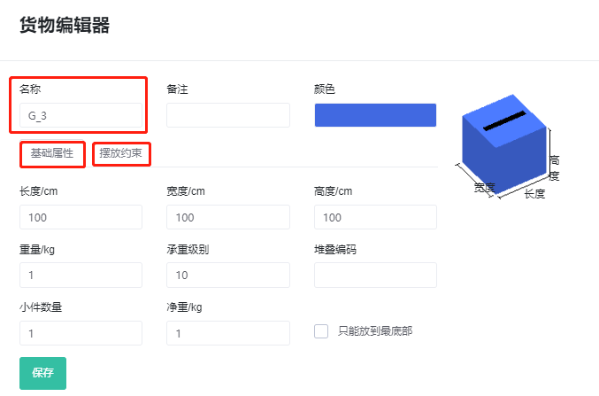

# a、货物管理

装箱大师提供了货物数据库功能，
若每款产品尺寸是固定不变的，不会因订单的不同导致货物尺寸的变化，可以将货物数据一次性批量导入到软件中数据库存储，可提高后续配载计算的工作效率。

可以通过直接添加和批量导入两种方式。可根据货物数据量的大小决定是“批量导入”还是通过“直接添加”逐个添加。

1）直接添加：点击“直接添加货物”，然后编辑货物的名称（名称必须唯一）、长宽高、摆放方式等信息，也可以定义货物的承重级别，最后点击保存，货物信息就添加到数据库中。

2）批量导入：
货物管理界面右上方“获取EXCEL导入模板—填写模板---“从EXCEL表格中导入”。

**模板填写说明**

* 货物名称必须唯一，不得重名。
* 备注栏可以重名。
* 重量不得为空。若是轻货且不清楚具体重量，可填写为1。
* 模板中默认六种摆放方式都允许，即随意摆放。只需将不允许的摆放方式下的“允许”一栏填写为0：0表示不允许，1或不填，都代表允许。
* 货物的承重级别、只能放在最底部、堆叠层数等参数也可以维护到数据库中

凡已经做过初始化的货物，后续算柜时，在《装箱单导入模板》中，不需要填写货物的长宽高重、摆放方式等已经维护好的参数，只需要填写货物名称、数量、以及其他涉及到参数，但一定要保证《装箱单导入模板》的货物名称与软件中存储的货物名称完全一致，这样软件才能根据货物名称自动从数据库中抓取该货物的尺寸、摆放方式等信息。

