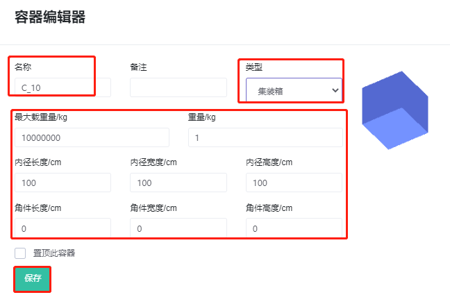
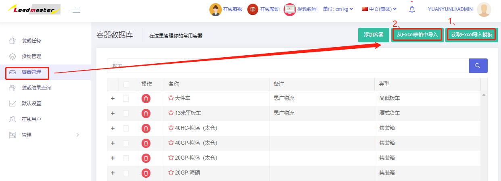

# b、容器管理

装箱大师提供了容器数据库功能，可以保存经常用到的容器类型，避免重复输入。

可以通过直接添加和批量导入两种方式：可根据容器数据量的大小决定是“批量导入”还是通过“新建”逐个添加。

1）直接添加：点击“添加容器”，然后编辑容器的名称（名称必须唯一）；类型及此类型容器的属性，详见容器属性，最后点击保存，容器信息就添加到数据库中。

2）批量导入：容器管理界面右上方“获取EXCEL导入模板—填写模板---“从EXCEL表格中导入”。

**模板填写说明**

* 容器名称必须唯一，不得重名。
* 备注栏可以重名。
*  将容器的名称、长宽高复制进来，这是必填项，注意数据单位的匹配
* 定义容器的类型：0代表纸箱;1代表平托盘;2代表箱式托盘;3代表集装箱;6代表平板车，然后根据容器的类型定义对应的参数。

经常用容器信息维护到数据库后，在容器界面直接点击“从数据库添加”即可，不用每次输入容器的长宽高等信息，可以进一步地提高后续算柜的工作效率。

