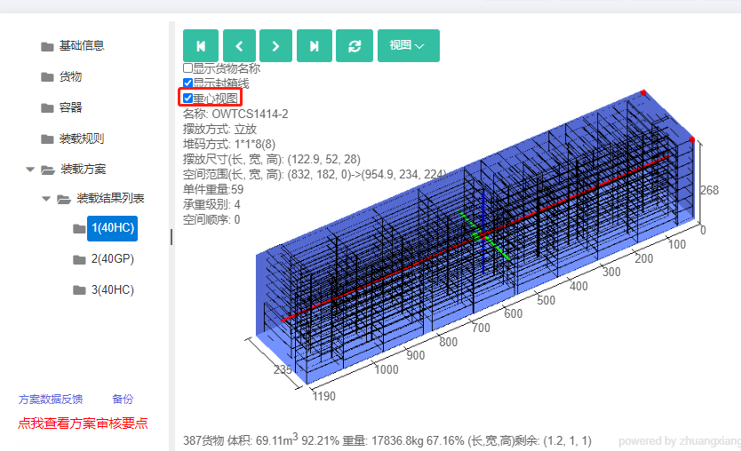

# 6、装载方案

装载方案界面主要是展示得出的方案结果：

1）左侧是使用容器情况，显示此方案使用了什么规格的货柜，分别使用了几个。

2）中间是当前容器的3D立体效果图，分别点击容器名称，可以看到每个货柜的3D图。

3）右侧是当前容器的装载的货物清单、装载步骤、平衡分析。

4）左下角是当前容器装载货物的数量、体积、体积利用率、重量、重量利用率、长宽高剩余尺寸。

5）3D效果图的左上角有播放按钮，可以分布步查看装载情况；也可以查看货柜的俯视图、后视图等。点击某个装卸块，在左上角可以看到此装卸块的货物名称，摆放方式、堆码方式（几行几列几层和总数量）、货物尺寸、空间范围及设置的相关参数等。

6）在播放按钮下方，可以选择是否在3D图显示货物名称、是否显示封箱线、可以查看重心视图。

