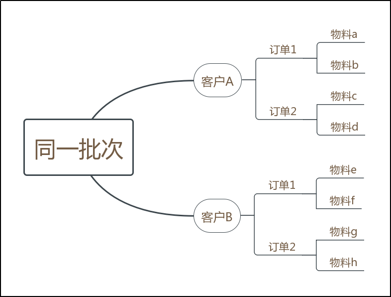
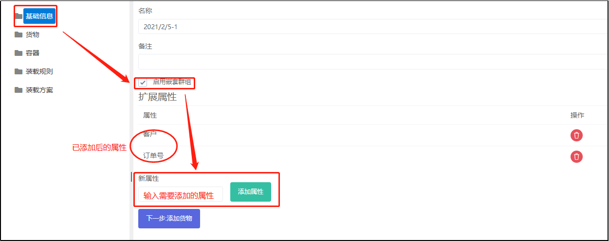
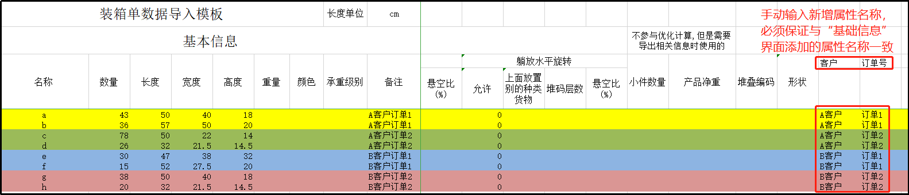
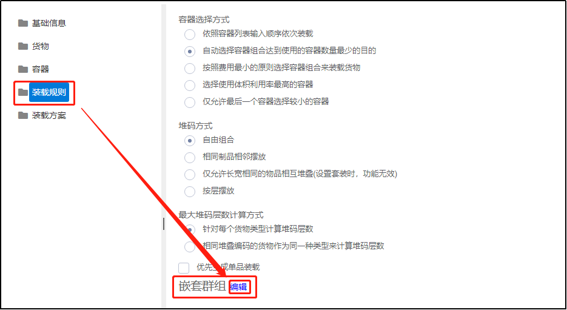
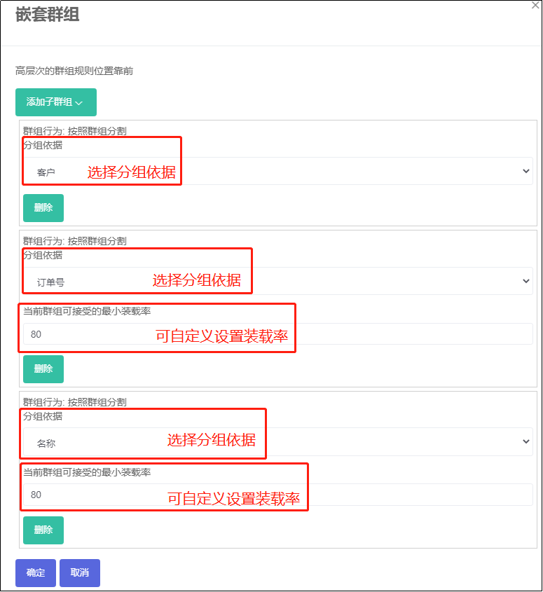
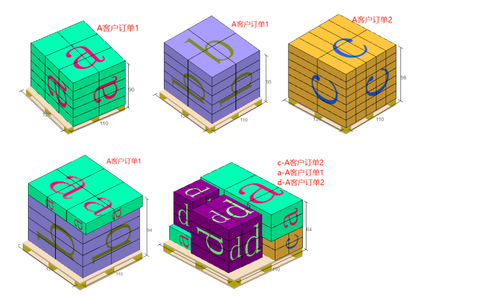
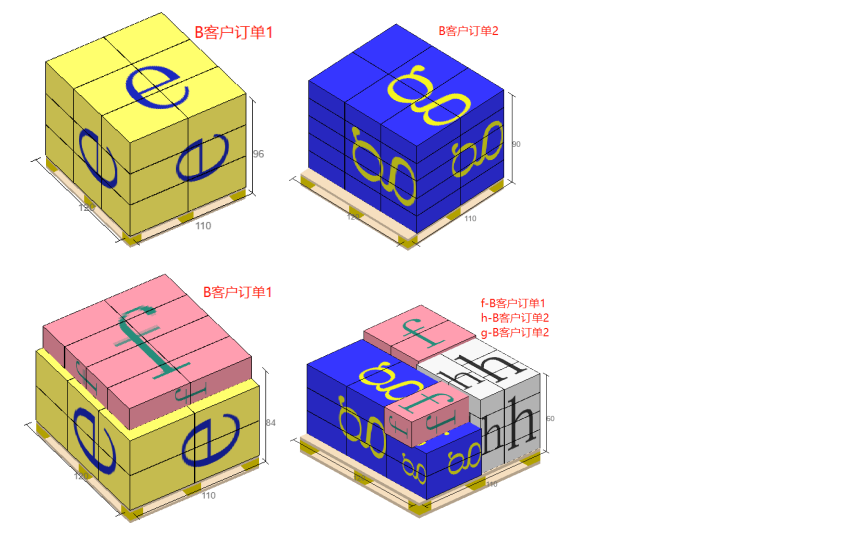

# 10）嵌套群组


1、应用场景：

同一批次的货物，分为不同客户，而同一客户下又有不同的订单，同一订单中又含多种物料。当计算它们如何装柜（打托、装箱）时，要求不同客户的不能混装；同一个客户的同一订单尽量少分装；且一个订单中同一物料的货物尽量少分装，但若存在尾数箱，则优先和同一订单的其他物料混装；同一订单的货物的尾数优先与同一客户的其他订单混装，循环往复，依此类推。

如下图：  

1） 同一批次下，客户A和客户B的货物不能混装。

2）同一物料尽量少分装容器，当存在尾数箱时，可以与该物料所在订单的其他物料混装。

比如：客户A-订单1中的物料a和物料b分别优先装满一个或多个单品容器，当分别剩下的货物都不满一个单品容器时，客户A-订单1中的a、b物料可以混装。

3）同一客户下，同一订单尽量少分装；当存在尾数货物时，可以与该客户的其他订单混装。

比如：客户A的订单1和订单2分别优先装满一个或多个单一订单容器，当分别剩下的货物不满一个单一订单容器时，客户A下的订单1和订单2可以混装。

2、具体操作步骤如下：

1）“基础信息”界面

2）“货物”界面：选择“添加货物”，点击“获取Excel导入模板”，填写模板。

3）“装载规则”界面

嵌套群组设置时，上图中的群组从上到下，装载条件是从宽松到严格，从这一层群组到上一层群组间的货物混装时的划分标准就是【当前群组可接受的最小装载率】这一参数。

比如：按照【名称】（即物料名称）划分群组时，上图中设置的装载率是80，也就是客户A-订单1中的物料a及物料b分别装满一个容器时，只要达到80%及以上的装载率，就会生成一个单品容器；若达不到80%，则客户A-订单1中的物料a的尾数箱就会与物料b的尾数箱进行混装，也就是依据上一层【订单号】来划分群组...... 以此类推，最外层的【客户】群组不再进行分拆混装，所以不需要设置可接受的最小装载率。

设置完成，点击【确定】，配载规则-嵌套群组下就可看到如下图的展示

最后得出的装载结果满足客户需求。

 

 

 

 

