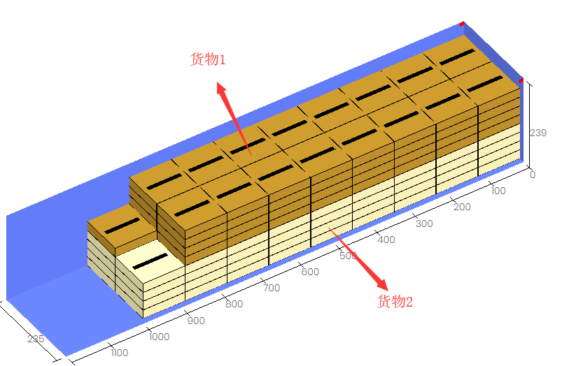

# 堆叠编码

堆叠编码可用来限制不同货物相互叠加时堆叠的总层数：将不同货物设置相同的堆叠编码和最大堆码层数，软件就可以将他们视为同种货物来计算最大堆码层数。

例如：要求货物1和货物2无论自身堆叠还是相互堆叠都不超过4层。

若只设置货物1、货物2的最大堆码层数为4层，得出的效果是货物1自身堆叠不超过4层、货物2自身堆叠不超过4层，但是他们会相互堆叠，层数就会超过4层。只是分别针对每种货物来计算堆码层数，如图

这就需要设置堆叠编码：

1、在货物界面或导入模板中，将货物1、2设置相同的堆叠编码（堆叠编码可以是数字或英文字母或汉字，只要相同即可），最大堆码层数都设为4。

2、在装载规则界面，将最大堆码层数计算方式选择为“相同堆叠编码的货物作为同一种类型来计算堆码层数”。

得出的装载方案部分效果如图：货物1和货物2无论自身堆叠还是相互堆叠都不超过4层。

