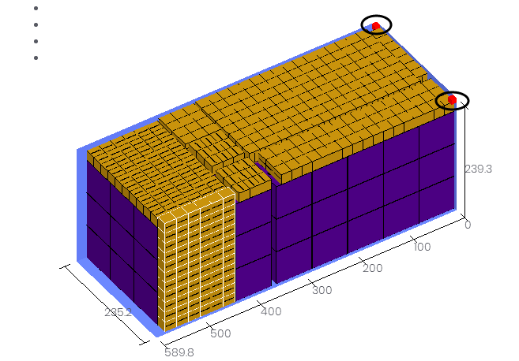

# b、如何合理躲避集装箱内部角件

角件是集装箱顶角的两个紧固件，虽占据集装箱空间不大，即使装箱人员凭经验装箱技巧，往往也会因估计不足而出现少装货物或集装箱装不下的情况。装箱大师只需要用户定义角件尺寸，在优化方案时自动躲避角件。

第一步：打开登陆页面输入用户名密码登陆，选择任务类型，详情请查看[装载任务](https://legacy.gitbook.com/book/loadmaster/loadmaster-manual/edit#)。第二步：在“货物”界面，直接添加或批量导入货物信息，详情请查看[添加货物的方法](https://doc.zhuangxiang.com/gong-neng-jie-shao/zhuang-zai-fang-an-she-ji-jie-mian/huo-wu/tian-jia-huo-wu-de-fang-fa.html)。

第三步：进入“容器”界面，点击“从数据库中导入”添加需要的货柜（软件数据库中已存储常用的集装箱信息，当然也可以在数据库中自定义容器信息），集装箱内部有两个角件，尺寸为10CM\*10CM\*10CM，具体设置如图：

第四步：进入“装载规则”界面，若没有其他装在要求，按默认值即可，点击下一步。

第五步，点击装载方案，查看3D效果图

**注意：**

1）系统对集装箱角件的值默认为零，用户可以根据实际尺寸填写。集装箱角件尺寸平均在10CM左右，一般不超过15CM。

2）设置集装箱角件尺寸时，注意输入的数值与选用的长度单位相匹配。例如，10CM的角件，习惯使用mm单位的，请将单位定义为mm，然后输入100。装箱大师软件支持英制、公制单位的自动换算。

