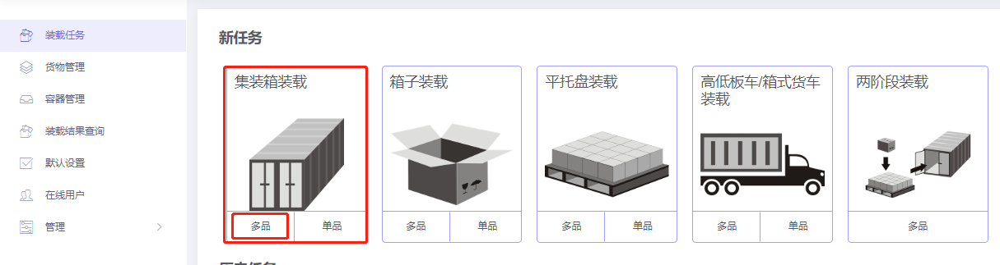

# f、如何实现货物轻重搭配装载

当不同承重能力的货物混装时，为了保证货物不受损坏，要考虑货物轻重搭配装载。那么在软件中如何定义呢？

下面通过一个示例来讲解：

**装箱数据：**

| 名称 | 数量 | 长度\(cm\) | 宽度\(cm\) | 高度\(cm\) | 重量（kg） | 包装 |
| :--- | :--- | :--- | :--- | :--- | :--- | :--- |
| A | 10 | 235 | 44 | 144.7 | 570 | 木箱 |
| B | 6 | 210 | 75 | 122 | 480 | 木箱 |
| C | 11 | 220 | 55 | 70 | 426 | 木箱 |
| D | 32 | 88 | 66 | 35 | 80 | 纸箱 |
| E | 3 | 126 | 114.3 | 99 | 240 | 纸箱 |
| F | 5 | 120 | 80 | 122 | 260 | 纸箱 |

**装载要求：**

1）货物只能开口方向朝上摆放。

2）纸箱要放在木箱的上方，且货物A只能放在最底部，货物D上方不允许放其他货物。

3）计算这批货用什么柜型装载合适，几个装完。

根据当前装载要求，应选择“集装箱装载/多品”任务类型，点击进入。

进入基础信息填写界面，基础信息是选填项，用户可根据实际工作要求，填写PO单号、运单号或目的港等信息，方便以后查阅。接下来，开始方案的设计：

**第一步：**点击左侧的【货物】，进入货物界面，因货物种类较多，所以使用excel批量导入。

1）首先要获取导入模板，点击【添加货物】下的“获取excel导入模板”，另存到桌面。

2）填写导入模板（下载好的模板会自动打开）：

①首先将货物的名称、数量、长宽高、重量复制进来，这是必填项。重量是单件货物的毛重，注意单位的匹配。

②然后定义货物的摆放方式，因本案例要求货物只能纸箱开口朝上摆放，即只能立放、立放水平旋转，所以要将其他摆放方式下的“允许”一栏填写为“0”，0表示不允许，1或者不填表示允许。

③最后定义装载属性：

因要求纸箱要放在木箱的上方，所以需要定义货物的“承重级别”。承重级别是一个相对值，数值越大代表承重能力越强，越放在下面。模板中所有货物的承重级别都默认为10，所以可以将ABC的承重级别设置为较大值20，DEF设置为19。

又要求A只能放在最底部，所以需要将A的“只能放在最底部”设置为“1”，1表示只能放在最底部，0或者不填表示没有此要求。

还要求D上方不允许放其他货物，所以需要需要将C【立放】【立放水平旋转】下的“上面放置其他货物”设置为“0”，0表示不允许上面放置其他货物，1或者不填表示允许。

本案例中其他装载要求不涉及，因此模板中其他参数不用设置，按默认值即可。实际工作中若有其他要求，涉及到相关参数的设置，可参考上文中的相关介绍。模板填写完成，保存后关闭。

3）回到软件的货物界面，点击【添加货物】下的“从excel表格中导入”，在弹框中找到填写好的模板，点击打开，货物数据就全部导入到软件中了。

**第二步：**点击左侧的【容器】，进入容器界面。因用户不知道用什么货柜装载，用几个装完，因此需要将常用的柜型都添加进来，以便软件从中选择合适的柜型装载。软件数据库中已经储备了常用的容器信息，点击“从数据库添加”，在弹框中勾选20GP、40GP，和40HC，点击“添加”。关闭弹框然后分别定义集装箱的角件和保留尺寸，角件的尺寸为10\*10\*10cm。关于定义保留尺寸的注意事项，请参考《如何模拟纸箱胀箱和人工摆放间隙》。

**第三步：**点击左侧的【装载规则】，进入装载规则，因此案例不涉及其他的配载要求，所以装载规则按默认设置即可，不需要改动。

点击“自动优化”，得出装载方案。在左侧列表可以看到这批货物使用了1个4GP装完。中间是3D装载效果图，通过3D图可以看出，纸箱放在了木箱的上方，且货物A放在了最底部，货物D上方没有放其他货物，完全满足客户需求。

图的右侧有当前货柜的货物统计、装载步骤和平衡分析，详情请查看《装载方案》界面介绍。

方案审核完成后，可以分享装载方案用来指导现场装载和下载装箱报表用来制作装箱单和报关单，具体方法步骤可以查看文档中的相关介绍。

