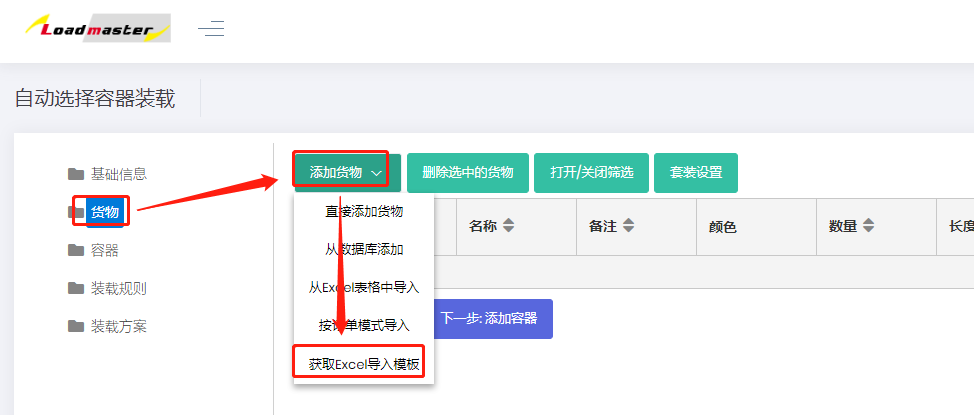
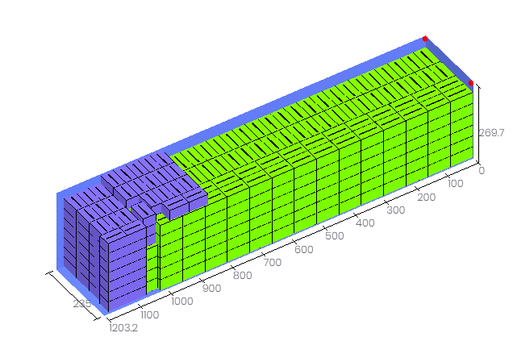
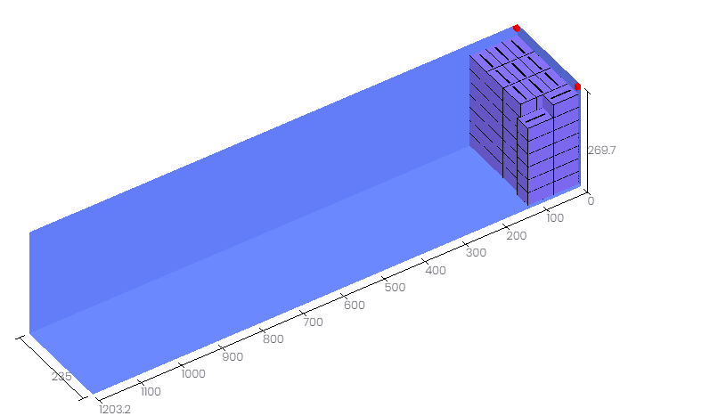

# 10、如何固定一些容器的方案不变，针对个别容器重新计算

在使用软件进行配载优化，得出装箱方案后，对某些容器的效果满意，想保持不变，针对部分容器修改。例如使个别容器达到某种效果，修改配载规则、增加、卸载货物等。

下面我们通过一个示例来讲解：

| 名称 | 数量 | 长度\(cm\) | 宽度\(cm\) | 高度\(cm\) |
| :--- | :--- | :--- | :--- | :--- |
| A | 850 | 76.4 | 47.1 | 39.5 |
| B | 1000 | 72.7 | 42.2 | 38.2 |
| C | 1100 | 62.2 | 39.2 | 34.2 |

本案例中有ABC三种货物，装载要求是:

1、ABC三种货物都是只能高垂直于地面。

2、相同的货物尽量摆放在一起，若货柜上方有空余可以放别的货物。

3、计算用几个40HC装完。

根据当前装载要求，我们应选择“自动选择容器装载”任务类型，点击进入。进入基础信息填写界面，基础信息是选填项，用户可根据实际工作要求，填写PO单号、运单号或目的港等信息，方便以后查阅。接下来开始方案的设计。

**二、具体操作步骤**

**第一步：**点击“货物”按钮或下一步添加货物，进入货物界面。点击“添加货物”中的“获取Excel导入模板”，另存到桌面。

1）打开下载的导入模板，将货物的名称、数量、尺寸、重量等数据复制到模板中。

因要求货物只能高垂直于地面，即对应的摆放方式是立放、立放水平旋转，所以需要在货物A、B、C、的“侧放、侧放水平旋转、躺放、躺放水平旋转”的“允许”一栏设置为0。0表示不允许，不填或填写1表示允许。

因本案例中其他装载要求不涉及，因此模板中其他参数不用设置，按默认值即可。实际工作中若有其他要求，涉及到相关参数的设置，可参考相关介绍。模板填写完成，保存后关闭。

2）返回到货物界面，点击“添加货物”，再点击“从excel表格中导入”，在弹框中找到填写完成的导入模板，点击“打开”，货物数据就全部导入到软件中了。**第二步：**点击“容器”按钮或下一步添加容器，进入容器界面。因用户要计算几个40HC能装完，所以我们点击“从数据库添加”，在弹框中找到40HC，点击导入，关闭弹框。然后定义集装箱的角件和保留尺寸，角件的尺寸为10\*10\*10cm。关于定义保留尺寸的注意事项，[请参考在线帮助中的相关介绍](https://doc.zhuangxiang.com/auditing-plan/zhang-xiang-huo-bai-fang-jian-xi.html)。**第三步：**点击“设置装载规则”或下一步设置配载规则，进入配载规则界面，因要求相同的货物尽量摆放在一起，所以将“堆码方式”选择为“相同制品相邻摆放”，并注意交叉深度的设置。关于交叉深度，请参考[相关介绍](https://doc.zhuangxiang.com/page/Loading%20Rule/base%20rule/across-depth.html)。本案例，我们可以先按默认值计算看看方案效果点击自动计算，生成装载方案。在左侧容器列表可以看到使用了6个40HC，

但是第3、4货柜上方可以放置其他货物却没装载，

第4个货柜是因为设置2米的交叉深度，我们把交叉深度设置较大数值例如1200，重新计算，可以看到第四个货柜上方放置了别的货物。但是第6个货柜剩余一部分货物C却没放到第3个货柜的上方。

这是因为我们设置相同制品相邻摆放，它是针对一个货柜中的货物。要想使第6个货柜剩余一部分货物C放到第3个货柜的上方，就要用到固定重计算功能。

点击装载结果列表，将集装箱1245固定，在点击装载规则，将“堆码方式”改为自由组合。再点击自动计算，得出装载方案，货柜125没有变化，货柜236得出新的装载方案，最后使用了5个40HC。

在装载结果列表也可以看到，可以固定某些集装箱方案不变，针对某个集装箱可以添加或者卸载某些货物，重新生成方案。

