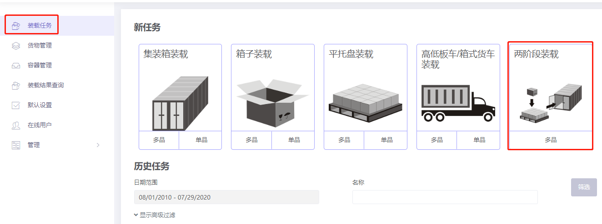

# a、如何实现货物先打托后装集装箱的装载要求

货物需要先计算如何打托再装集装箱，如何在软件中定义？

下面通过一个示例来讲解：

**装箱数据：**

| **名称** | **数量** | **长（cm）** | **宽（cm）** | **高（cm）** |
| :---: | :---: | :---: | :---: | :---: |
| A | 320 | 60 | 50 | 20 |
| B | 360 | 30 | 25 | 20 |
| C | 128 | 55 | 55 | 30 |
| D | 240 | 25 | 55 | 30 |

**装载要求:**

1）货物不能长垂直于地面。

2）一步计算货物如何打到托盘上，用什么规格的托盘，和使用什么规格的集装箱更合适，分别用几个装完。

3）托盘限高1.1米（包括托盘自身高度）。

根据当前装载要求，应选择“两阶段装载”任务类型，点击进入。

进入基础信息填写界面，基础信息是选填项，用户可根据实际工作要求，填写PO单号、运单号或目的港等信息，方便以后查阅。接下来，开始方案的设计：

**第一步：**点击左侧的【货物】，进入货物界面，因货物种类较多，所以使用excel批量导入。

1）首先要获取导入模板，点击【添加货物】下的“获取excel导入模板”，另存到桌面。

2）填写导入模板（下载好的模板会自动打开）：

①将货物的名称、数量、长宽高复制进来，这是必填项。重量是单件货物的毛重，若货物重量较轻可以忽略，重量可以不填写，若货物较重，为了不超重安全运输，重量必须填写，注意单位的匹配。

②然后定义货物的摆放方式，因本案例要求货物不能长垂直于地面摆放，即不能躺放、躺放水平旋转，所以要将躺放、躺放水平旋转下的“允许”一栏填写为“0”，0表示不允许，1或者不填表示允许。

③最后定义装载属性，因要求货物先打托后装集装箱，所以货物的“包装方式”都设置为“1”。0或不填表示货物直接装集装箱；1表示货物自由选择合适的托盘/纸箱；2表示货物使用指定的中间包装装载。

本案例中其他装载要求不涉及，因此模板中其他参数不用设置，按默认值即可。实际工作中若有其他要求，涉及到相关参数的设置，可参考上文中的相关介绍。模板填写完成，保存后关闭。

3）回到软件的货物界面，点击【添加货物】下的“从excel表格中导入”，在弹框中找到填写好的模板，点击打开，货物数据就全部导入到软件中了。

**第二步：**点击左侧的【容器】，添加集装箱。因用户不知道用什么货柜装载，用几个装完，因此需要将常用的柜型都添加进来，以便软件从中选择合适的柜型装载。点击“从数据库添加”，在弹框中勾选20GP、40GP，和40HC，点击“添加”。关闭弹框，然后分别定义集装箱保留尺寸，关于定义保留尺寸的注意事项，请参考[《如何模拟纸箱胀箱和人工摆放间隙》]()。

**注意本案例是托盘装柜，为了方便叉车作业，高度保留尺寸要设置为10cm；因此集装箱角件10CM也就被扣除掉了，所以角件尺寸不用设置。**

**第三步：**点击左侧的【中间容器】，添加托盘。因用户不知道用什么规格的托盘装载，所以需要将常用的托盘都添加进来，以便软件择合适的托盘。若是数据库中没有常用托盘，可以点击“直接添加”下的平托盘，然后编辑名称、长宽高等信息，为了避免每次重复输入，也可以将常用托盘维护到数据库中，具体方法步骤请参考上文中的[《容器管理》]()。

本案例，点击“从数据库添加”在弹框中找常用的欧标和亚标托盘，点击导入，关闭弹框。然后按照用户要求分别定义托盘的最大摆放高度为110cm。

**第四步：**点击【装载规则】按钮，定义托盘装集装箱时的配载规则。因本案例托盘装集装箱时不涉及其他的装载要求，所以按默认设置即可，不需要改动。

**第五步：**点击左侧的【中间包装装载规则】，定义货物打托时的装载规则。因此案例打托时不涉及其他的装载要求，所以按默认设置即可，不需要改动。

点击自动优化，得出装载方案。根据左侧容器列表可以统计出这批货物使用了32个1200\*1000托盘、10个1100\*1100托盘，最后使用了1个40GP装完。分别点击容器名称，可以看到每个容器的3D装载效果图，图的右侧有当前容器的货物统计、装载步骤和平衡分析。

方案审核完成后，可以分享装载方案手机指导现场装载和下载装箱报表用来制作装箱单和报关单，具体方法步骤可以查看文档中的相关介绍。

