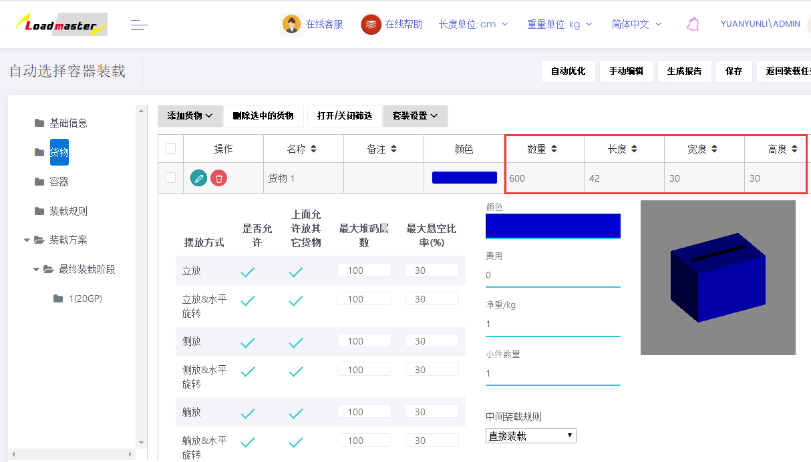
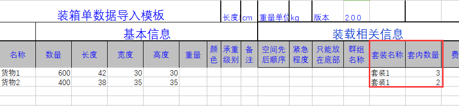
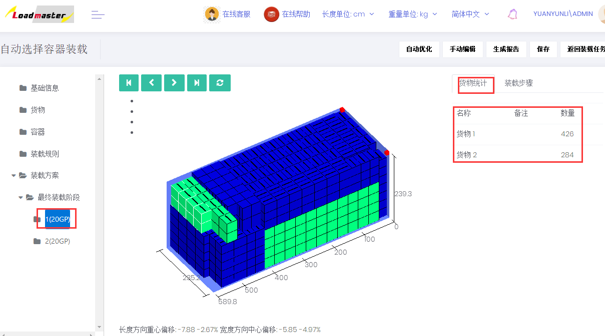

# 5、如何实现货物按比例成套装载

家具行业，经常会要求一个货柜里装载的都是成套的家具。比如一张桌子和三张椅子为一套家具。装箱大师是通过套装功能实现的。

举例：货物NO1尺寸：42\*30\*30cm，货物NO2 尺寸大小：38\*35\*35cm,计算货物NO1和 NO2装柜数量按照比例3:2装柜，一个20尺柜可以装多少？

**具体操作步骤：**

第一步：打开登陆页面输入用户名密码登陆，在“装载任务”中选择“自动选择容器装载”任务类型。第二步：填写基础信息，可以根据自己需求选填任务的名称和备注，比如可以备注订单号方便以后查找，然后点击下一步添加货物。

第三步：“货物”界面

因货物要求3：2比例装载，有两种设置方法，选其一即可。

1）直接添加货物

①点击“添加货物”中的“直接添加货物”，添加两个新货物。②编辑货物的属性：长、宽、高、数量、摆放方式（如无特殊要求不需要改动）等。

注：因要计算能装多少套，所以货物数量填写较大数值。③定义套装，设置套装比例。

点击“套装设置”按钮，在弹框中，先填写套装的名称（可以是汉字、字母、数字或他们的组合），然后点击“添加套装”。

在套装名称列表，点击套装名称后的绿色编辑按钮。然后找到套装内的货物1、2，点击货物名称后的绿色加号按钮，添加套装中的货物1、2及定义套装数量3：2。

最后关闭弹框，套装定义完成。

## 注意：套装内的货物，货物的数量要和套内数量比例一致。

2）从excel表格中导入

①先获取导入模板，填写货物长宽高、数量等。

②在模板中定义套装名称和套内数量，名称必须一致。第四步：“容器”界面

点击“从数据库添加”,选择20尺高柜（软件数据库中已存储常用的集装箱信息，当然也可以在数据库中自定义容器信息），设置保留尺寸和角件（详情可查看[容器属性](https://doc.zhuangxiang.com/page/container/property.html)中集装箱对应属性），最后点击“下一步设置配载规则”。第五步：“装载规则”界面

因为货物装载没有其他特殊要求，所以不需要改动，按软件默认值即可，详细解释可查看装载规则中[基本装载规则](https://doc.zhuangxiang.com/page/Loading%20Rule/base%20rule.html)，点击“下一步自动优化”。

第六步：“装载方案”界面

计算完成后得出装载方案，如图：通过上图可以看出，用一个20GP按照比例3：2装载了426个货物1、284个货物2。在此界面也可以查看具体的装载步骤。

