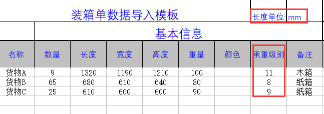
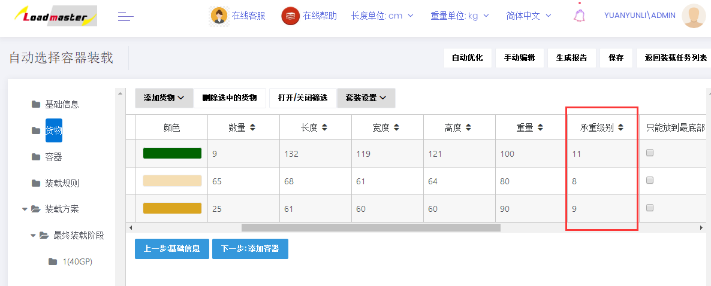
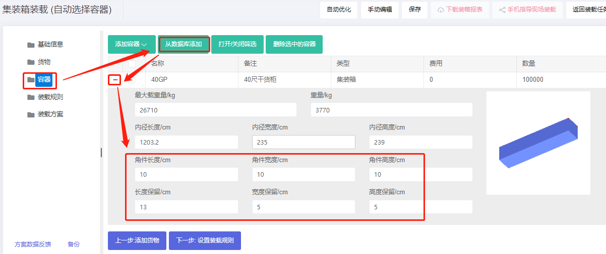
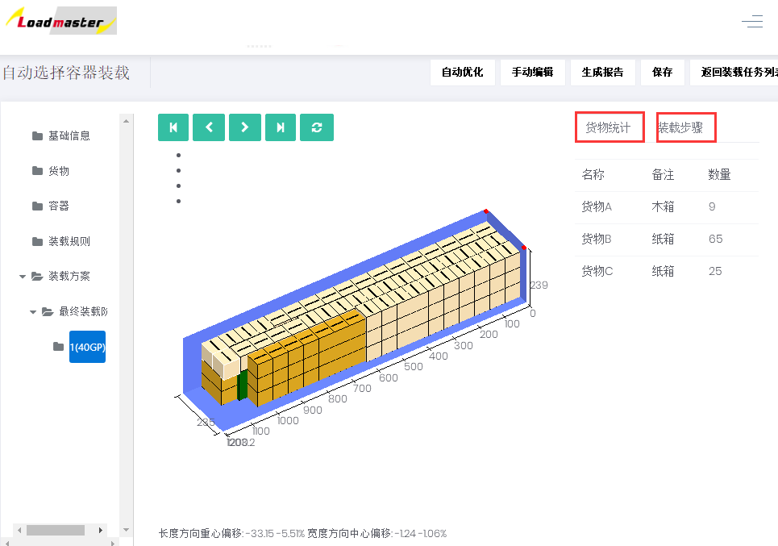
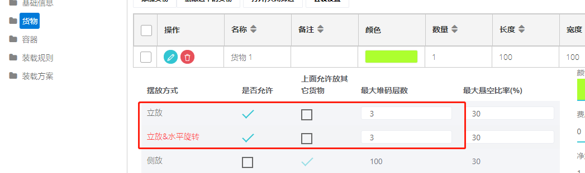
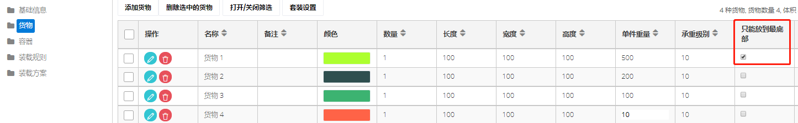
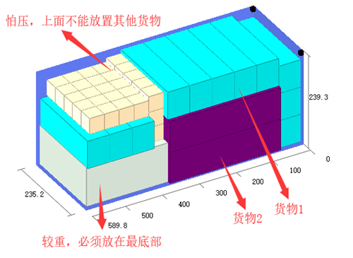

# 3、如何实现货物轻重搭配装载

当不同承重能力的货物混装时，为了保证货物不受损坏，要考虑货物轻重搭配装载。用户只需要自定义货物的承重级别就可以实现，承重级别数值越大，代表着货物承重压力的能力越强。下面我们简单用一个实例来直观的介绍：

一、**装箱数据及装箱要求**

| 名称 | 数量 | 长度\(mm\) | 宽度\(mm\) | 高度\(mm\) | 重量（kg） | 包装 |
| :--- | :--- | :--- | :--- | :--- | :--- | :--- |
| 货物A | ９ | 1320 | 1190 | 1210 | 100 | 木箱 |
| 货物B | 65 | 680 | 610 | 640 | 80 | 纸箱 |
| 货物C | 25 | 610 | 600 | 600 | 90 | 纸箱 |

**装载要求：**

1）ABC三种货物只能高垂直于地面。

2）木箱在下、纸箱在上；轻的纸箱在上、重的在下。

3）装40尺普柜。

二、**具体操作步骤**

打开登陆页面输入用户名密码登陆，在“装载任务”中选择“集装箱装载”任务类型。

进入基础信息界面，可以根据自己需求选填任务的名称和备注，比如可以备注订单号方便以后查找**。**

第一步：点击左侧“货物”，添加货物，有四种添加方法，详见[添加货物的方法](https://doc.zhuangxiang.com/gong-neng-jie-shao/zhuang-zai-fang-an-she-ji-jie-mian/huo-wu/tian-jia-huo-wu-de-fang-fa.html)。此订单货物种类较多，我们使用批量导入：

1）点击“添加货物”下的“获取Excel导入模板“，另存到桌面，下载好的导入模板会自动打开。

2）填写导入模板

①将货物的名称、数量、长宽高复制进来，这是必填项。重量是单件货物的毛重，若货物重量较轻可以忽略，重量可以不填写，若货物较重，为了不超重安全运输，重量必须填写，注意单位的匹配。

②定义货物的摆放方式，因本案例要求货物只能纸箱开口朝上摆放，即只能立放、立放水平旋转，所以要将其他摆放方式下的“允许”一栏填写为“0”，0表示不允许，1或者不填表示允许。编辑货物属性：

③最后定义装载属性：因要求木箱在下、纸箱在上；轻的纸箱在上、重的在下，所以货物A、B、C的“承重级别”分别设为11、8、9.

**※承重级别是一个相对值，数值越大表示承重能力越强，也就越放下面，反之放在上面**。

3\)回到软件的货物界面，点击【添加货物】下的“从excel表格中导入”，在弹框中找到填写好的模板，点击打开，货物数据就全部导入到软件中了。

第二步：点击左侧“容器”，添加集装箱

点击“从数据库添加”,选择40尺普柜（软件数据库中已存储常用的集装箱信息，当然也可以在数据库中自定义容器信息），设置保留尺寸和角件（详情可查看[容器属性](https://doc.zhuangxiang.com/gong-neng-jie-shao/zhuang-zai-fang-an-she-ji-jie-mian/rong-qi/rong-qi-shu-xing.html)中集装箱对应属性）。

第三步：点击“装载规则”，因为货物装载没有其他特殊要求，所以不需要改动，按软件默认值即可，详细解释可查看装载规则。

第四步：点击”自动优化“，计算完成后，得出装载方案，如图：

通过3D装载效果图可以看出，货物完全实现重不压轻的要求，用一个40GP装完。

方案审核完成后，可以分享装载方案用来指导现场装载和下载装箱报表用来制作装箱单和报关单，具体方法步骤可以查看文档中的相关介绍。

## **若货物怕压，必须放在集装箱顶部，可以将货物设置较小的堆码层数，并设置上面不允许放置其他货物。**

## \*\*\*\*

## 若货物较重，必须放在最底下一层，自身也不能叠加，可将货物的堆码层数设置为1，并设置必须放在最底部。

