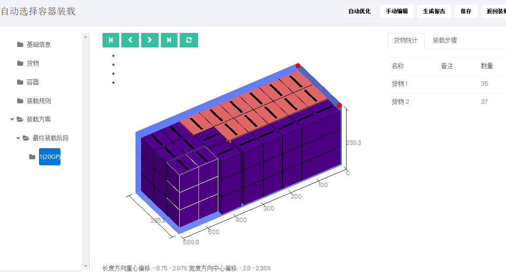
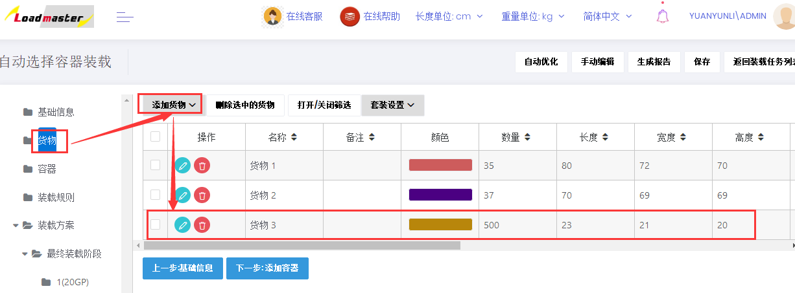
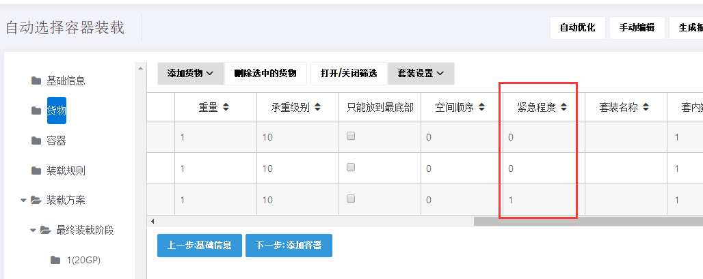
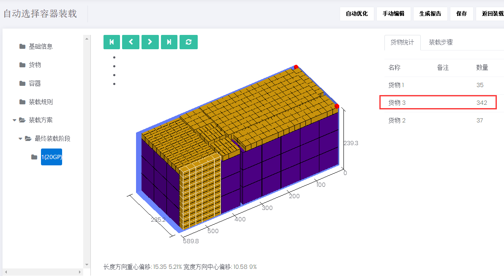

# 7、如何在剩余空间填塞货物

实际业务中，国外客户有时会要求装完一批货物后，尽量塞满其他小件货物，以降低单位产品运费成本。如下图是一批货物有两种物品，选用20尺寸集装箱，装载结果如下：利用“紧急程度”在集装箱剩余空间可以塞一些小件货物，尺寸为23\*21\*20cm，具体操作步骤如下：

第一步：在“货物”界面，点击“添加货物”中“直接添加货物”，编辑要填塞的小件货物尺寸，数量填写较大数值。第二步：将要填塞的货物3的“紧急程度”设为1（紧急程度“1”表示填充，“0”表示不填充）。注：填塞的货物种类较多时，也可以在excel批量导入模板表格中定义紧急程度。

第三步：自动优化，得出新方案在上图中可以看出，集装箱又填充了342个小件货物3。

