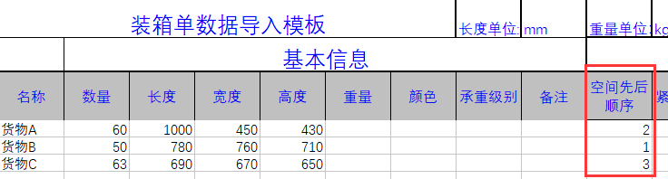
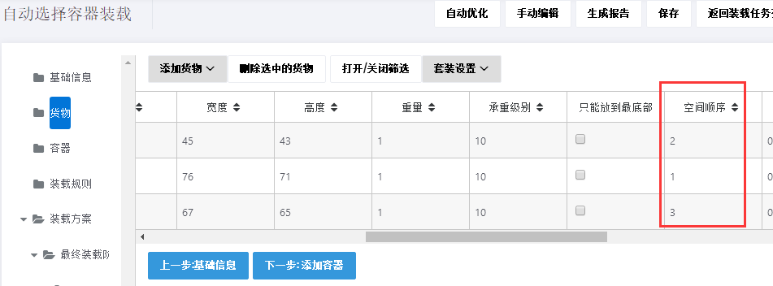
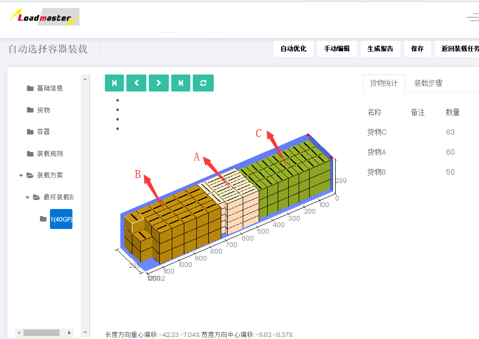

# 4、如何实现货物先后依次装载

例如有三种货物需要出口，分别为A、B、C，需要在三个不同港口卸货，根据客户的需求，卸货顺序为B、A、C。那么通过装箱大师软件中设置货物的空间顺序，可以设计出完全满足这一需求的方案。

**一、装箱数据及装箱要求**

| 名称 | 数量 | 长度\(mm\) | 宽度\(mm\) | 高度\(mm\) |
| :--- | :--- | :--- | :--- | :--- |
| 货物A | 60 | 1000 | 450 | 430 |
| 货物B | 50 | 780 | 760 | 710 |
| 货物C | 63 | 690 | 670 | 650 |

**装载要求：**

1）ABC三种货物只能高垂直于地面。

2）卸货顺序为B、A、C。

3）装40尺普柜。

**二、具体操作步骤**

打开登陆页面输入用户名密码登陆，在“装载任务”中选择“集装箱装载”任务类型。

进入基础信息界面，可以根据自己需求选填任务的名称和备注，比如可以备注订单号方便以后查找**。**

第一步：点击左侧“货物”，添加货物，有四种添加方法，详见[添加货物的方法](https://doc.zhuangxiang.com/page/goods/add%20way.html)。此订单货物种类较多，我们使用批量导入：

1）点击“添加货物”下的“获取Excel导入模板“，另存到桌面，下载好的导入模板会自动打开。 

2）填写导入模板

①将货物的名称、数量、长宽高复制进来，这是必填项。重量是单件货物的毛重，若货物重量较轻可以忽略，重量可以不填写，若货物较重，为了不超重安全运输，重量必须填写，注意单位的匹配。

 ②定义货物的摆放方式，因本案例要求货物只能纸箱开口朝上摆放，即只能立放、立放水平旋转，所以要将其他摆放方式下的“允许”一栏填写为“0”，0表示不允许，1或者不填表示允许。编辑货物属性：

③最后定义装载属性：因要求卸货顺序为B、A、C，也就是装载顺序C、A、B，所以货物A、B、C的“空间顺序” 分别设为2、1、3。

**※空间顺序的大小表示该货物装载的先后顺序，它是个相对值，数值越大的货物越先装载，反之后装。**

3\)回到软件的货物界面，点击【添加货物】下的“从excel表格中导入”，在弹框中找到填写好的模板，点击打开，货物数据就全部导入到软件中了。

第二步：点击左侧“容器”，添加集装箱。点击“从数据库添加”,选择40尺普柜（软件数据库中已存储常用的集装箱信息，当然也可以在数据库中自定义容器信息），设置保留尺寸和角件（详情可查看[容器属性](https://doc.zhuangxiang.com/page/container/property.html)中集装箱对应属性）。

第三步：点击“装载规则”，进入装载规则界面，在设置了“空间顺序”后，要注意交叉深度的设置。一般情况下，交叉深度数值越大，装载率越高。

那么什么是交叉深度呢？通过下面的示例图，更直观些。

图中不同的颜色代表不同的产品。大家可以看到左边的图中，在装完一种产品后，即使它的上方和右方有闲置的空间，也不会装载下一款产品。这是因为设置的交叉深度为0所致，这时装载率为88%，而右边的图中，相邻的两款产品交界处会有局部的上下左右的混合搭配。这是因为设置了1米的交叉深度，此时装载率提升到92.46%。这就是设置交叉深度的重要性， 软件中交叉深度的默认值是2米。

本案例中，可以先按默认值计算看看方案效果，点击自动优化，生成装载方案：

通过上图可以看出，货物完全按照要求的顺序装载，用一个４０GP装完。

方案审核完成后，可以分享装载方案用来指导现场装载和下载装箱报表用来制作装箱单和报关单，具体方法步骤可以查看文档中的相关介绍。

