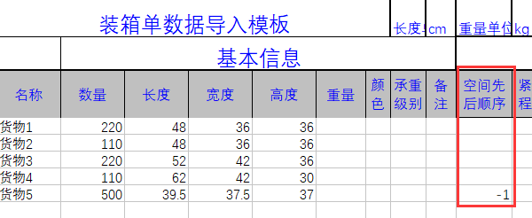
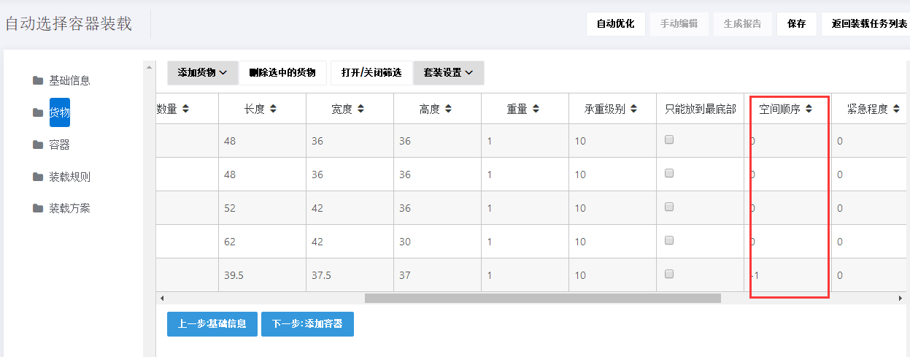
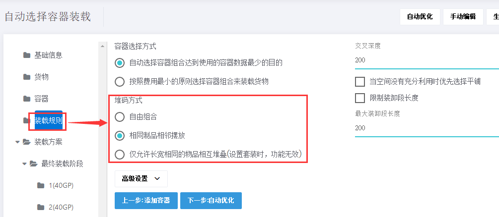
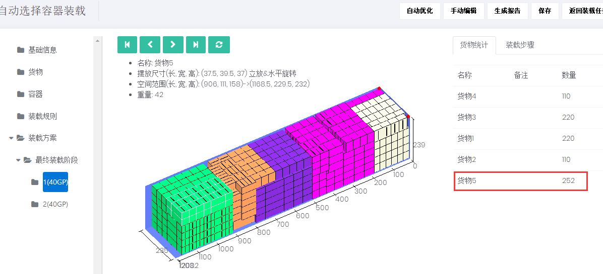
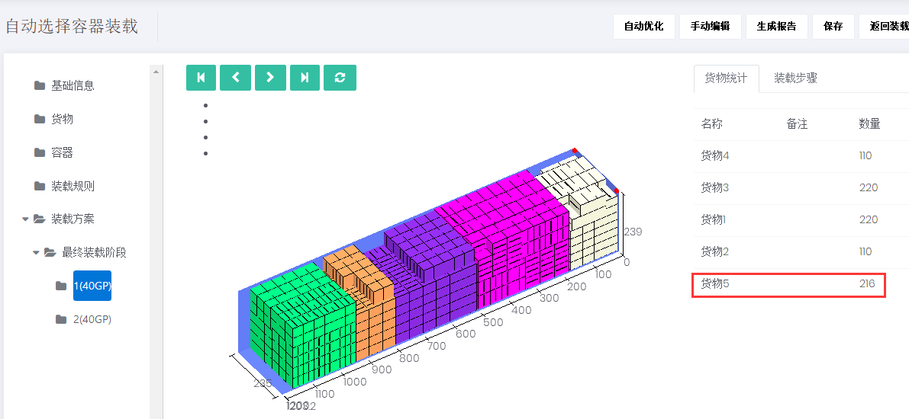
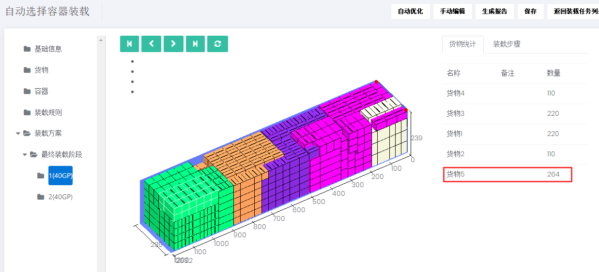

# 6、如何实现同种货物相邻摆放装载

在用装柜软件设计方案时时，为了提高货柜的空间利用率一般是十几种不同品种货物混合装载。但是现场装载时师傅往往习惯尽可能的使相同的物品放在一起，这样方便现场操作装载和理货。这就需要通过装柜软件“相同制品相邻摆放”功能来实现。

一、**装箱数据及装箱要求**

| 产品号 | 件数 | 长（cm） | 宽（cm） | 高（cm） |
| :--- | :--- | :--- | :--- | :--- |
| 货物1 | 220 | 48.0 | 36.0 | 36.0 |
| 货物2 | 110 | 48.0 | 36.0 | 36.0 |
| 货物3 | 220 | 52.0 | 42.0 | 36.0 |
| 货物4 | 110 | 62.0 | 42.0 | 30.0 |
| 货物5 | 500 | 39.5 | 37.5 | 37.0 |

**装载要求：**

1）货物在摆放方式上没有要求，但同种货物要摆放在一起。

2）货物5是最后装在货物，能装多少装多少。

3）装一个40尺普柜。

**二、具体操作步骤：**

第一步：打开登陆页面输入用户名、密码登陆，在“装载任务”中选择“自动选择容器装载”任务类型。第二步：填写基础信息，可以根据自己需求选填任务的名称和备注，比如可以备注订单号方便以后查找，然后点击下一步添加货物。第三步：“货物”界面

添加货物，有四种添加方法，详见[添加货物的方法](https://doc.zhuangxiang.com/page/goods/add%20way.html)。因此订单货物种类较多，我们使用批量导入：

1）点击“添加货物”，先获取Excel模板，在模板中填写货物的信息——货物的名称，备注，数量，长度，宽度，高度，重量等（所有长度和重量的单位在网页的最上端）。2）在模板编辑货物属性：因要求货物5最后装载，所以货物5的空间顺序设为较小数值。

**※空间顺序的大小表示该货物装载的先后顺序，它是个相对值，数值越大的货物越先装载，反之后装**。

3）通过”Excel导入”到装箱软件，如下图所示。第四步：“容器”界面

点击“从数据库添加”,选择40尺普柜（软件数据库中已存储常用的集装箱信息，当然也可以在数据库中自定义容器信息），设置保留尺寸和角件（详情可查看[容器属性](https://doc.zhuangxiang.com/page/container/property.html)中集装箱对应属性），点击“下一步设置配载规则”。第五步：“装载规则”界面

因为要求同种货物摆在一起，所以在将“堆码方式”选为“相同制品相邻摆放“，要注意交叉深度的设置（详见[基本装载规则](https://doc.zhuangxiang.com/page/Loading%20Rule/base%20rule.html)），系统默认2米。第六步：“装载方案”界面

计算完成后得出装载方案，如图：通过上图可以看出，在“交叉深度”默认2米时，一个40GP中货物5装了252个。

注：①将交叉深度改为0米时，货物完全不交叉，一个40GP中货物5装了216个装载方案如下：

②将交叉深度改为3米时，一个40GP中货物5装了264个，装载方案如下：

